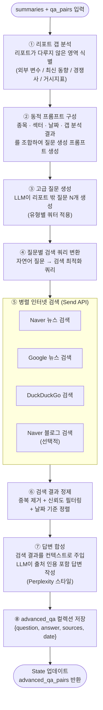

# AdvancedQAAgent 상세 설계

**작성일:** 2026-04-13

---

## 1. 기존 QAAgent와의 차이

| 항목 | QAAgent | AdvancedQAAgent |
|------|---------|-----------------|
| 질문 소스 | 리포트 내용에서만 추출 | 리포트를 읽고 **리포트 밖**의 질문 생성 |
| 답변 소스 | RAG(리포트 청크) 검색 | **인터넷 실시간 검색** (Naver / Google / DDG) |
| 질문 성격 | 리포트가 이미 답을 가진 질문 | 리포트가 답을 모르는 질문, 미래 전망, 외부 변수 |
| 저장 컬렉션 | `summaries`, `qa_pairs` | `advanced_qa` |
| 비용 | 낮음 (소형 모델 가능) | 높음 (질문 생성 + 검색 + 답변 종합) |

---

## 2. 역할 정의

AdvancedQAAgent는 리포트를 읽은 뒤 **"이 리포트가 답하지 못한 것"** 을 질문으로 만들고,  
인터넷 검색으로 최신 정보를 수집하여 답변을 완성한다.  

미니 Perplexity처럼 출처를 인용하며 답변하고, 결과를 RAG에 저장하여 WriterAgent가 보고서 작성 시 활용한다.

---

## 3. 처리 흐름



---

## 4. 질문 생성 유형 분류

AdvancedQAAgent는 다음 6가지 유형의 질문을 생성한다.  
각 유형별로 최소 1개 이상 생성하도록 쿼터를 적용한다.

| 유형 | 설명 | 예시 |
|------|------|------|
| **① 최신 뉴스형** | 리포트 발행 이후 새로 발생한 사건 | "리포트 발행 후 삼성전자에 영향을 준 주요 뉴스는?" |
| **② 거시 환경형** | 금리·환율·유가 등 외부 변수 | "현재 달러/원 환율이 반도체 수출에 미치는 영향은?" |
| **③ 경쟁사 비교형** | 동종업계 경쟁사 동향 | "TSMC와 삼성전자의 최근 수주 경쟁 현황은?" |
| **④ 정책·규제형** | 정부 정책, 규제 변화 | "미국의 반도체 수출 규제 최신 동향은?" |
| **⑤ 미래 전망형** | 리포트가 다루지 않은 중장기 시나리오 | "2027년 HBM 시장 수요 전망은?" |
| **⑥ 투자자 반응형** | 시장 참여자들의 현재 시각 | "현재 외국인 투자자들의 삼성전자 매매 동향은?" |

---

## 5. 동적 프롬프트 설계

AdvancedQAAgent의 핵심은 **컨텍스트에 따라 프롬프트가 동적으로 구성**된다는 점이다.  
아래는 프롬프트 템플릿과 각 변수가 어떻게 채워지는지 설명한다.

### 5.1 갭 분석 프롬프트 (Step ①)

```
[시스템]
당신은 투자 분석 전문가입니다.
오늘 날짜: {today}  ← 실시간 주입

[지시]
아래는 {ticker}({company_name}) 에 대한 증권사 리포트 요약입니다.
리포트 발행일: {report_date}
섹터: {sector}

[리포트 요약]
{summaries}

[기존 QA]
{qa_pairs_text}

위 리포트와 QA를 분석하여, 다음 항목에서 **다루지 않았거나 부족한 부분**을 식별하세요:
1. 리포트 발행 이후 발생했을 외부 변수 (뉴스, 정책, 경쟁사)
2. 거시 경제 지표 (환율, 금리, 원자재)
3. 경쟁사 동향
4. 정부/규제 변화
5. 시장 참여자(외국인/기관) 반응
6. 중장기 시나리오 (리포트가 다루지 않은 기간)

출력: 각 항목별로 1~2줄 갭 설명
```

### 5.2 질문 생성 프롬프트 (Step ③)

```
[시스템]
당신은 투자 리서치 질문 설계 전문가입니다.
오늘 날짜: {today}
분석 대상: {ticker} / {company_name} / 섹터: {sector}

[갭 분석 결과]
{gap_analysis}

[지시]
위 갭 분석을 바탕으로, 인터넷 검색으로 답할 수 있는 질문을 총 {total_n}개 생성하세요.
반드시 아래 유형별 쿼터를 맞추세요:

- 최신 뉴스형     : {n_news}개   (리포트 발행일 {report_date} 이후 기준)
- 거시 환경형     : {n_macro}개  (환율/금리/유가 등 수치 포함 질문 우선)
- 경쟁사 비교형   : {n_comp}개   (구체적 경쟁사명 포함)
- 정책·규제형     : {n_policy}개 (국가명 또는 기관명 포함)
- 미래 전망형     : {n_future}개 (연도 또는 기간 명시)
- 투자자 반응형   : {n_investor}개 (외국인/기관/수급 데이터 포함)

조건:
- 각 질문은 단독으로 검색 가능한 수준으로 구체적으로 작성
- 리포트가 이미 명확히 답한 내용은 제외
- 오늘 날짜({today}) 기준 현재 상황을 묻는 질문 우선

출력 형식 (JSON):
[
  {{"type": "최신뉴스형", "question": "...", "search_hint": "검색 시 사용할 핵심 키워드"}},
  ...
]
```

### 5.3 동적 변수 매핑

```python
def build_question_prompt(state: AdvancedQAState) -> str:
    """
    리포트 특성에 따라 질문 유형별 쿼터를 동적으로 조정
    """
    ticker = state["topic"]
    sector = get_sector(ticker)          # 섹터 자동 분류
    gap = state["gap_analysis"]
    days_since_report = (today - state["report_date"]).days

    # 리포트가 오래될수록 뉴스형 질문 비중 증가
    n_news    = 3 if days_since_report > 30 else 2
    n_macro   = 2
    n_comp    = 2 if sector in ["반도체", "자동차", "배터리"] else 1
    n_policy  = 2 if sector in ["반도체", "바이오", "방산"] else 1
    n_future  = 1
    n_investor = 1
    total_n   = n_news + n_macro + n_comp + n_policy + n_future + n_investor

    return QUESTION_PROMPT_TEMPLATE.format(
        today=today,
        ticker=ticker,
        company_name=state["company_name"],
        sector=sector,
        report_date=state["report_date"],
        gap_analysis=gap,
        total_n=total_n,
        n_news=n_news,
        n_macro=n_macro,
        n_comp=n_comp,
        n_policy=n_policy,
        n_future=n_future,
        n_investor=n_investor,
    )
```

### 5.4 검색 쿼리 변환 프롬프트 (Step ④)

자연어 질문을 검색 엔진에 최적화된 쿼리로 변환한다.

```
[지시]
아래 질문을 뉴스 검색에 최적화된 한국어 검색 쿼리로 변환하세요.
오늘 날짜: {today}
질문: {question}
search_hint: {search_hint}

조건:
- 3~6개 핵심 키워드로 압축
- 날짜가 필요하면 "최근" 또는 연월 포함
- 불필요한 조사·어미 제거

출력: 검색 쿼리 문자열 1개
```

### 5.5 답변 합성 프롬프트 (Step ⑦)

```
[시스템]
당신은 투자 분석 리서처입니다. 검색 결과를 바탕으로 정확하고 간결하게 답변합니다.
오늘 날짜: {today}

[질문]
{question}

[검색 결과]
{search_results}
※ 각 결과에는 출처(source), 날짜(date), 본문(content)이 포함됩니다.

[지시]
1. 검색 결과를 종합하여 질문에 답변하세요.
2. 반드시 출처를 [출처명, 날짜] 형식으로 인용하세요.
3. 검색 결과로 답하기 어려운 경우 "검색 결과 불충분"이라고 명시하세요.
4. 답변은 3~5문장으로 요약하고, 핵심 수치가 있으면 반드시 포함하세요.

출력 형식:
답변: ...
출처: [출처1, 날짜], [출처2, 날짜]
신뢰도: 높음 / 중간 / 낮음  ← 검색 결과 품질 기반 자체 평가
```

---

## 6. RAG 저장 스키마 (`advanced_qa` 컬렉션)

```json
{
  "id": "adv_qa_삼성전자_20260413_003",
  "text": "Q: 미국의 대중 반도체 수출 규제 최신 동향은?\nA: 2026년 4월 기준 ...",
  "metadata": {
    "type": "advanced_qa",
    "question_type": "정책규제형",
    "question": "미국의 대중 반도체 수출 규제 최신 동향은?",
    "answer": "2026년 4월 기준 ...",
    "sources": [
      {"name": "연합뉴스", "url": "...", "date": "2026-04-11"},
      {"name": "한국경제", "url": "...", "date": "2026-04-10"}
    ],
    "confidence": "높음",
    "ticker": "005930",
    "sector": "반도체",
    "search_date": "2026-04-13",
    "report_date": "2026-04-10",
    "date_weight": 1.0
  }
}
```

---

## 7. 전체 에이전트 연결도

```
ReportCollectAgent
    └─► report_chunks
            │
            ▼
        QAAgent ──────────────────────────────┐
            ├─► summaries                     │
            └─► qa_pairs                      │
                    │                         │
                    ▼                         ▼
            AdvancedQAAgent  ←── summaries + qa_pairs 입력
                    │  인터넷 검색 (Naver/Google/DDG)
                    └─► advanced_qa ──────────────────┐
                                                      │
                    ┌─────────────────────────────────┘
                    ▼
               TOCAgent      ← qa_pairs + advanced_qa 참조
               WriterAgent   ← qa_pairs + advanced_qa 참조
```

---

## 8. 비용·성능 최적화

| 최적화 항목 | 방법 |
|------------|------|
| 중복 검색 방지 | 동일 질문 해시 기반 캐싱 (TTL: 24시간) |
| 저품질 결과 필터 | 신뢰도 "낮음" 답변은 RAG 저장 제외 |
| 검색 소스 선택 | 정책·규제형은 뉴스만 / 투자자 반응형은 증권 전문 사이트 우선 |
| 질문 수 조절 | 리포트 발행일이 오늘이면 총 6개 / 30일 이상이면 최대 10개 |
| 모델 선택 | 질문 생성·갭 분석: Sonnet / 답변 합성: Sonnet / 쿼리 변환: Haiku |

---

## 9. QAAgent와의 실행 순서

AdvancedQAAgent는 QAAgent 완료 후 실행된다.  
단, 수집 파이프라인 전체와는 독립적으로 추후 재실행도 가능하다.

```
① ReportCollectAgent  ─┐
② NewsAgent           ─┤  병렬
③ QAAgent             ─┘
        │
        ▼ (QAAgent 완료 후)
④ AdvancedQAAgent      ← summaries + qa_pairs 소비
        │
        ▼
   advanced_qa → RAG 저장
        │
        ▼
⑤ TOCAgent (advanced_qa 포함하여 검색)
```
