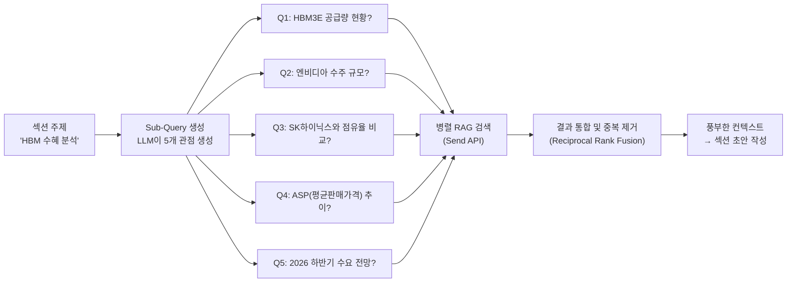
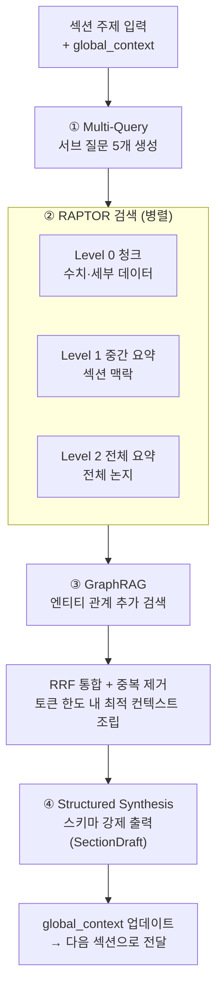

# 구조화된 RAG 설계 — Advanced RAG 패턴

**작성일:** 2026-04-13

---

## 1. 기본 RAG의 한계

기본 RAG는 **"질문 → 청크 검색 → 답변"** 의 단순 구조다.

```
질문: "삼성전자 반도체 실적은?"
  ↓
청크 A: "1Q26 반도체 영업이익 6.2조..."
청크 B: "HBM3E 공급 확대..."
청크 C: "메모리 가격 반등..."
  ↓
답변: 청크들을 이어 붙인 단편적 요약
```

| 문제 | 설명 |
|------|------|
| **단편성** | 청크 3~5개를 이어붙인 수준 — 전체 맥락 누락 |
| **반복** | 여러 청크가 비슷한 내용을 중복 포함 |
| **인과 부재** | "실적이 좋다"는 말하지만 "왜, 어떻게, 이후는?" 불명확 |
| **단일 관점** | 하나의 쿼리로만 검색 → 다양한 각도 누락 |
| **엔티티 관계 미약** | 삼성전자-TSMC-엔비디아 간 연결 관계를 청크에서 찾기 어려움 |

---

## 2. 구조화된 RAG 전략 4가지

이 시스템에 적합한 4가지 Advanced RAG 패턴을 조합하여 사용한다.

```
① Multi-Query RAG     — 다각도 검색
② RAPTOR              — 계층적 요약 트리
③ GraphRAG (경량)     — 엔티티 관계 추출
④ Structured Synthesis — 구조화된 출력 강제
```

---

## 3. ① Multi-Query RAG — 다각도 검색

하나의 섹션 주제에서 **여러 서브 질문을 생성**하고 각각 검색한 뒤 종합한다.



### 구현

```python
# WriterAgent 내부
async def multi_query_retrieve(section_title: str, state: WriterState) -> str:
    # 1. 서브 질문 생성
    sub_queries = await llm.ainvoke(
        SUB_QUERY_PROMPT.format(
            section_title=section_title,
            topic=state["topic"],
            n=5
        )
    )  # → ["HBM3E 공급량은?", "엔비디아 수주 규모는?", ...]

    # 2. 병렬 RAG 검색
    results = await asyncio.gather(*[
        rag_search(q, collections=["reports", "summaries", "qa_pairs", "news"])
        for q in sub_queries
    ])

    # 3. Reciprocal Rank Fusion으로 중복 제거 및 재순위
    merged = reciprocal_rank_fusion(results)

    # 4. 컨텍스트 조립
    return format_context(merged, max_tokens=4000)
```

### 서브 질문 생성 프롬프트

```
[지시]
보고서 섹션 "{section_title}"을 작성하기 위해
RAG 검색에 사용할 서브 질문 {n}개를 생성하세요.

조건:
- 각 질문은 서로 다른 관점 (현황 / 원인 / 비교 / 수치 / 전망)
- 검색에 최적화된 구체적 질문 (수치, 기간, 비교 대상 포함)
- 서로 중복되지 않을 것

출력: 질문 목록 (JSON 배열)
```

---

## 4. ② RAPTOR — 계층적 요약 트리

기본 RAG는 청크 단위로만 검색한다.  
RAPTOR는 **청크 → 중간 요약 → 전체 요약** 으로 계층을 만들어 저장소에 함께 보관한다.  
덕분에 세부 수치도 찾고, 전체 맥락도 찾을 수 있다.

```
Level 0 (청크):     "1Q26 반도체 영업이익 6.2조, 전년 대비 +28%..."
                    "HBM3E 공급 물량 QoQ +40% 증가..."
                    "파운드리 수율 개선으로 원가 3% 절감..."
        ↓ 클러스터링 + 요약
Level 1 (중간):     "1Q26 반도체 부문은 HBM 수혜와 수율 개선으로
                     전년 대비 28% 성장. 영업이익 6.2조 달성."
        ↓ 요약
Level 2 (전체):     "삼성전자는 AI 반도체 수요 급증에 힘입어
                     2026년 상반기 실적 턴어라운드를 달성했다."
```

### RAG DB 저장 구조 (RAPTOR 적용)

```python
# 기존 reports 컬렉션에 level 메타데이터 추가
{
    "id": "chunk_001",
    "text": "1Q26 반도체 영업이익 6.2조...",
    "metadata": {"level": 0, "parent_id": "summary_001", ...}
}
{
    "id": "summary_001",
    "text": "1Q26 반도체 부문은 HBM 수혜로...",
    "metadata": {"level": 1, "parent_id": "top_summary_001", "child_ids": ["chunk_001", ...]}
}
{
    "id": "top_summary_001",
    "text": "삼성전자는 AI 반도체 수요 급증에...",
    "metadata": {"level": 2, "child_ids": ["summary_001", ...]}
}
```

### 검색 전략

```python
def raptor_search(query: str, detail_level: str = "auto") -> list[dict]:
    """
    detail_level:
      "high"   → level 0 청크만 (수치, 세부 데이터 필요 시)
      "medium" → level 1 중간 요약 (섹션 작성 시 주로 사용)
      "low"    → level 2 전체 요약 (TOC 생성, 개요 파악 시)
      "auto"   → 전 레벨 검색 후 관련도 순 혼합
    """
    if detail_level == "high":
        return search(query, filter={"level": 0})
    elif detail_level == "medium":
        return search(query, filter={"level": 1})
    elif detail_level == "low":
        return search(query, filter={"level": 2})
    else:
        # auto: 전 레벨 검색 후 RRF 병합
        results = [search(query, filter={"level": l}) for l in [0, 1, 2]]
        return reciprocal_rank_fusion(results)
```

### 에이전트별 레벨 활용

| 에이전트 | 주요 레벨 | 이유 |
|---------|----------|------|
| TOCAgent | Level 2 (전체) | 큰 그림 파악, 목차 방향 설정 |
| WriterAgent | Level 1 (중간) + Level 0 (청크) | 섹션 구성 + 수치 인용 |
| QAAgent | Level 0 (청크) | 구체적 수치 질문에 답변 |
| AdvancedQAAgent | Level 1 (중간) | 갭 분석 시 전체 맥락 파악 |

---

## 5. ③ GraphRAG (경량) — 엔티티 관계 추출

청크는 관계를 표현하지 못한다.  
경량 GraphRAG는 **엔티티(회사, 제품, 인물)와 관계(경쟁, 공급, 투자)**를 추출하여  
관계 기반 검색을 가능하게 한다.

```
[엔티티 추출 예시]
청크: "삼성전자는 엔비디아에 HBM3E를 공급하며 점유율 50%를 차지하고 있다.
       TSMC의 CoWoS 패키징과 경쟁 구도를 형성 중이다."

→ 엔티티: 삼성전자, 엔비디아, HBM3E, TSMC, CoWoS
→ 관계:
   삼성전자 --[공급]--> 엔비디아
   삼성전자 --[경쟁]--> TSMC
   삼성전자 --[점유율 50%]--> HBM3E 시장
```

### 저장 구조 (graph 컬렉션 추가)

```python
# RAG DB에 graph 컬렉션 추가
{
    "id": "rel_001",
    "text": "삼성전자는 엔비디아에 HBM3E를 공급하며 점유율 50%",
    "metadata": {
        "type": "relation",
        "subject": "삼성전자",
        "predicate": "공급",
        "object": "엔비디아",
        "product": "HBM3E",
        "market_share": "50%",
        "source_chunk_id": "chunk_042",
        "date": "2026-04-10"
    }
}
```

### WriterAgent에서의 활용

```python
# "삼성전자의 경쟁 관계" 섹션 작성 시
relations = graph_search(
    subject="삼성전자",
    predicate_in=["경쟁", "공급", "협력"],
    limit=10
)
# → TSMC와 경쟁, 엔비디아에 공급, SK하이닉스와 경쟁 등 관계망 파악
```

---

## 6. ④ Structured Synthesis — 구조화된 출력 강제

RAG 검색 결과를 LLM에게 그냥 주면 자유 형식으로 답변한다.  
**출력 스키마를 강제**하면 보고서 섹션에 바로 쓸 수 있는 구조화된 결과가 나온다.

### 섹션 출력 스키마

```python
from pydantic import BaseModel

class SectionDraft(BaseModel):
    title: str                    # 섹션 제목
    summary: str                  # 핵심 요약 (2~3문장)
    key_points: list[str]         # 핵심 포인트 3~5개 (bullet)
    data_points: list[dict]       # 수치 데이터 [{"label": ..., "value": ..., "source": ...}]
    body: str                     # 본문 (500~800자)
    risks: list[str]              # 이 섹션과 관련된 리스크 (있을 경우)
    citations: list[dict]         # 출처 [{"text": ..., "source": ..., "date": ...}]

class ReportOutput(BaseModel):
    sections: list[SectionDraft]
    conclusion: str
    total_citations: list[dict]
```

### WriterAgent 프롬프트 (구조화 강제)

```
[지시]
아래 컨텍스트를 바탕으로 "{section_title}" 섹션을 작성하세요.

[컨텍스트]
{structured_context}

[이전 섹션 요약 — global_context]
{global_context}

반드시 아래 JSON 스키마로 출력하세요:
{{
  "title": "섹션 제목",
  "summary": "핵심 요약 2~3문장",
  "key_points": ["포인트1", "포인트2", "포인트3"],
  "data_points": [
    {{"label": "1Q26 영업이익", "value": "6.2조", "source": "KB증권 리포트 2026-04-10"}}
  ],
  "body": "본문...",
  "risks": ["리스크1", "리스크2"],
  "citations": [
    {{"text": "인용 문장", "source": "출처명", "date": "날짜"}}
  ]
}}

조건:
- data_points의 수치는 반드시 출처를 명시
- body는 summary를 단순 반복하지 말고 확장·설명
- global_context와 모순되는 내용은 작성 금지
```

---

## 7. 4가지 패턴 통합 흐름 (WriterAgent)



---

## 8. 컨텍스트 조립 전략

검색 결과가 많아도 LLM 컨텍스트 윈도우는 제한적이다.  
**토큰 예산**을 배분하여 최적 컨텍스트를 조립한다.

```python
CONTEXT_BUDGET = {
    "level_2_summary":  500,   # 전체 맥락 (적지만 필수)
    "level_1_summaries": 1500, # 중간 요약 (핵심)
    "level_0_chunks":   1500,  # 수치 데이터 (정확성)
    "graph_relations":   300,  # 관계 정보 (간결)
    "news":              700,  # 최신 뉴스 (시의성)
    "global_context":    500,  # 이전 섹션 맥락
    # 합계: ~5000 토큰
}

def assemble_context(results: dict, budget: dict) -> str:
    context_parts = []
    for source, max_tokens in budget.items():
        text = results.get(source, "")
        context_parts.append(truncate_to_tokens(text, max_tokens))
    return "\n\n---\n\n".join(context_parts)
```

---

## 9. RAG 품질 평가 루프 (선택적)

WriterAgent가 섹션 초안을 작성한 후,  
**LLM이 스스로 출처 일치 여부를 검증**하는 단계를 추가할 수 있다.

```
섹션 초안 작성
    ↓
Self-Grounding 검사:
  "이 문장의 수치/주장이 컨텍스트에 있는가?"
    ↓
Hallucination 감지된 문장 → 삭제 또는 "확인 필요" 표시
    ↓
검증된 초안 → global_context 업데이트
```

---

## 10. 기존 설계 대비 변경 사항 요약

| 항목 | 기존 | 변경 후 |
|------|------|---------|
| RAG 검색 | 단일 쿼리 → Top-K 청크 | Multi-Query → RRF 통합 |
| 저장 구조 | 청크 단위 flat | RAPTOR 계층 (Level 0/1/2) |
| 관계 검색 | 없음 | GraphRAG 경량 (엔티티-관계) |
| 출력 형식 | 자유 텍스트 | Pydantic 스키마 강제 |
| 컨텍스트 조립 | 검색 결과 그대로 | 토큰 예산 배분 최적화 |
| 품질 검증 | 없음 | Self-Grounding 검사 (선택) |

---

## 11. 구현 난이도와 우선순위

| 패턴 | 난이도 | 효과 | 우선순위 |
|------|--------|------|---------|
| Structured Synthesis | 낮음 | 높음 | **1순위** — 즉시 적용 가능 |
| Multi-Query RAG | 낮음 | 높음 | **1순위** — 코드 몇 줄 추가 |
| RAPTOR | 중간 | 높음 | **2순위** — 인덱싱 시간 필요 |
| GraphRAG | 높음 | 중간 | **3순위** — 엔티티 추출 파이프라인 별도 필요 |
