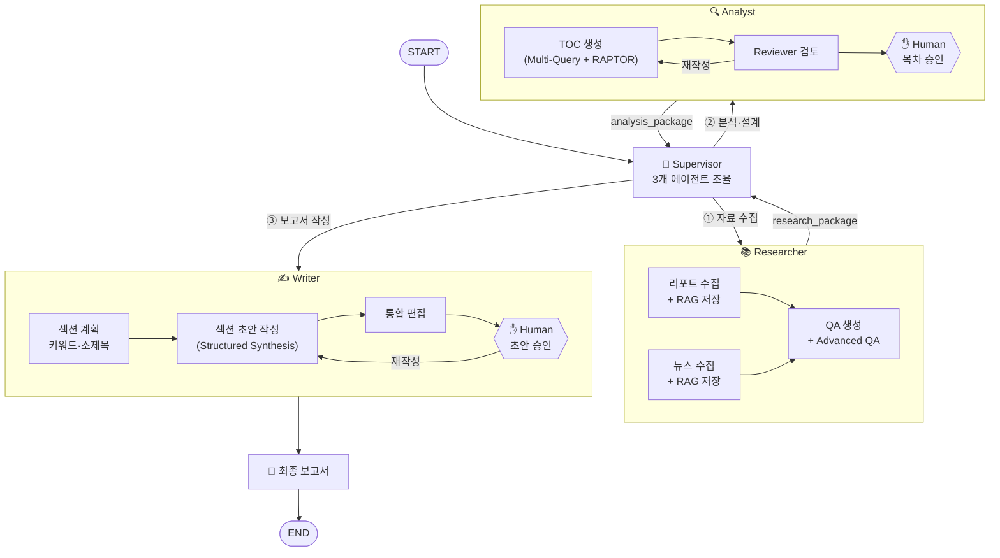

# 에이전트 구조 단순화 검토

**작성일:** 2026-04-13

---

## 1. 현재 구조 vs 단순화 구조

### 현재 구조 (8개 에이전트)
```
Supervisor
  ├── ReportCollectAgent
  ├── NewsAgent
  ├── QAAgent
  ├── AdvancedQAAgent
  ├── TOCAgent
  ├── ReviewerAgent
  ├── WriterAgent
  └── EditorAgent
```

### 단순화 구조 (4개 에이전트)
```
Supervisor
  ├── Researcher   (수집 담당)
  ├── Analyst      (분석·설계 담당)
  └── Writer       (생성·편집 담당)
```

---

## 2. 결론 먼저

**단순화하는 것이 맞습니다.**

단, 조건이 있다. 각 에이전트를 **내부에 서브그래프를 가진 "에이전트 그룹"** 으로 구현하면  
외부는 단순하고 내부는 정교한 구조가 된다.

---

## 3. 단순화가 의미 있는 이유

### 3.1 실제 팀 구조와 일치

현실에서 투자 리서치 팀이 일하는 방식 그대로다.

```
Researcher  → 자료 모아서 Analyst에게 전달
Analyst     → 분석하고 목차 잡아서 Writer에게 전달
Writer      → 보고서 초안 작성
Supervisor  → 전체 조율 및 품질 관리
```

LLM도 역할이 명확할수록 프롬프트가 단순해지고 품질이 올라간다.

### 3.2 Supervisor 복잡도 감소

현재 Supervisor는 8개 에이전트를 라우팅해야 한다.  
단순화하면 3개 에이전트만 관리하면 된다.

```python
# 현재: 8개 분기
def supervisor_router(state):
    if not report_chunks: return "report_collect"
    if not news_chunks:   return "news_agent"
    if not qa_pairs:      return "qa_agent"
    if not adv_qa:        return "advanced_qa"
    if not toc_draft:     return "toc_agent"
    if not review_done:   return "reviewer"
    if not sections_done: return "writer"
    if not edited:        return "editor"
    ...

# 단순화: 3개 분기
def supervisor_router(state):
    if not state["research_done"]: return "researcher"
    if not state["analysis_done"]: return "analyst"
    if not state["writing_done"]:  return "writer"
    return "finalize"
```

### 3.3 State 간 매핑 복잡도 감소

현재 에이전트 간 State 매핑이 8번 발생한다.  
단순화하면 3번으로 줄어든다.

### 3.4 에이전트 재사용성 향상

"Researcher"는 다른 도메인(부동산, 채권, 경제지표)에도 그대로 쓸 수 있다.  
ReportCollectAgent, NewsAgent 같은 세분화된 에이전트보다 재사용 범위가 넓다.

---

## 4. 역할 재정의

### Researcher
**책임:** 모든 원자료(raw material) 수집 및 RAG 저장

```
내부 서브그래프:
  ├── collect_reports  (ReportCollectAgent 역할)
  ├── fetch_news       (NewsAgent 역할)        ─ 병렬
  └── generate_qa      (QAAgent 역할)
        └── advanced_qa (AdvancedQAAgent 역할)

입력:  topic, ticker, sector
출력:  research_package {
         report_chunks, news_chunks,
         summaries, qa_pairs, advanced_qa_pairs
       }
```

### Analyst
**책임:** 수집된 자료를 분석하여 보고서 설계도(목차) 생성

```
내부 서브그래프:
  ├── build_toc        (TOCAgent 역할)
  ├── review_toc       (ReviewerAgent 역할)
  └── ✋ human_toc     (Human-in-the-Loop)

입력:  research_package
출력:  analysis_package {
         toc, global_context_seed
       }
```

### Writer
**책임:** 목차를 받아 보고서 본문을 작성하고 편집

```
내부 서브그래프:
  ├── plan_sections    (섹션별 키워드 계획)
  ├── write_section    (WriterAgent 역할, 반복)
  ├── edit_draft       (EditorAgent 역할)
  └── ✋ human_draft   (Human-in-the-Loop)

입력:  analysis_package + research_package
출력:  final_report
```

---

## 5. 단순화된 전체 구조



---

## 6. 단순화 전후 비교

| 항목 | 현재 (8개) | 단순화 (3+1개) |
|------|-----------|--------------|
| Supervisor 분기 수 | 8개 | 3개 |
| State 매핑 횟수 | 8번 | 3번 |
| 에이전트 간 인터페이스 | 복잡 | 명확 (package 단위) |
| 내부 병렬 처리 | Supervisor가 관리 | 각 에이전트가 자체 관리 |
| 디버깅 단위 | 노드 | 에이전트 (더 직관적) |
| 프롬프트 역할 명확성 | 세분화 | 역할 명확 (Researcher/Analyst/Writer) |
| 재사용성 | 낮음 | 높음 |
| 초기 구현 복잡도 | 높음 | 중간 |

---

## 7. 단순화 시 주의할 점

### 7.1 내부 병렬 처리는 유지
Researcher 내부에서 리포트 수집 + 뉴스 수집은 여전히 병렬로 실행해야 한다.  
단순화는 외부 인터페이스만 단순해지는 것이고, 내부 구현은 그대로다.

### 7.2 Checkpointer 적용 위치 변경
Human-in-the-Loop이 Analyst, Writer **내부**에 있으므로  
각 에이전트 서브그래프에 checkpointer를 개별 적용해야 한다.

```python
analyst_graph = analyst_flow.compile(
    checkpointer=checkpointer,
    interrupt_before=["human_toc_approval"]
)

writer_graph = writer_flow.compile(
    checkpointer=checkpointer,
    interrupt_before=["human_draft_approval"]
)
```

### 7.3 State 패키지 설계
에이전트 간 주고받는 단위가 "패키지"가 되므로, 패키지 스키마를 명확히 정의해야 한다.

```python
class ResearchPackage(TypedDict):
    report_chunks: list[dict]
    news_chunks: list[dict]
    summaries: list[str]
    qa_pairs: list[dict]
    advanced_qa_pairs: list[dict]

class AnalysisPackage(TypedDict):
    toc: list[dict]              # 확정 목차
    global_context_seed: str     # 초기 global_context

class SupervisorState(TypedDict):
    topic: str
    ticker: str
    sector: str
    # 패키지 단위로 관리
    research: ResearchPackage
    analysis: AnalysisPackage
    final_report: str
```

---

## 8. 최종 권장안

```
단순화를 채택하되, 내부 구현은 현재 설계를 유지한다.
```

```
외부 (Supervisor 관점):
  Researcher → Analyst → Writer
  [단순, 명확, 재사용 가능]

내부 (각 에이전트 관점):
  Researcher: collect_reports || fetch_news → generate_qa → advanced_qa
  Analyst:    build_toc → review_toc → human_toc
  Writer:     plan → write(반복) → edit → human_draft
  [정교, 병렬, 체크포인트 적용]
```

현재 8개 에이전트 문서(`news_agent.md`, `toc_agent.md` 등)는  
각 에이전트의 **내부 구현 설계서**로 그대로 유효하다.  
달라지는 것은 **외부에서 바라보는 인터페이스와 Supervisor 로직**뿐이다.
