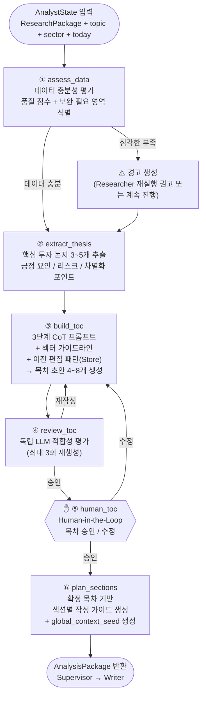

# Analyst 에이전트 상세 설계

**작성일:** 2026-04-13

---

## 1. 현재 Analyst의 문제

현재 Analyst 내부는 3개 노드로만 구성되어 있다.

```
build_toc → review_toc → human_toc
```

이 구조에는 다음 문제가 있다.

| 문제 | 설명 |
|------|------|
| **분석 없이 바로 목차 생성** | ResearchPackage를 받자마자 TOC를 만든다. 데이터 품질 확인이나 핵심 논지 추출 없이 바로 목차를 생성하면 방향이 흔들린다 |
| **글로벌 컨텍스트 생성 과정 불명확** | `global_context_seed`가 `AnalysisPackage`에 있는데, 어떤 노드가 어떻게 만드는지 정의되지 않았다 |
| **섹션 작성 가이드가 Writer에만 있음** | 각 섹션의 핵심 논지·키워드·예상 데이터 포인트를 Writer가 즉흥으로 결정한다. Analyst가 미리 계획해서 넘겨주면 Writer 품질이 올라간다 |
| **데이터 충분성 검증 없음** | 수집된 데이터로 목차의 모든 항목을 실제로 쓸 수 있는지 확인하지 않는다 |

---

## 2. 세분화 설계

3개 노드 → **6개 노드**로 세분화한다.

```
현재:
  build_toc → review_toc → human_toc

세분화 후:
  assess_data → extract_thesis → build_toc → review_toc → human_toc → plan_sections
```

---

## 3. 전체 내부 흐름



---

## 4. 노드별 상세 설명

### 4.1 `assess_data` — 데이터 충분성 평가

ResearchPackage를 받아 실제로 보고서를 쓸 수 있는 데이터가 충분한지 평가한다.  
이 단계 없이 TOC를 만들면 **데이터가 없는 섹션을 목차에 넣는 실수**가 발생한다.

```python
def assess_data(state: AnalystState) -> dict:
    """
    수집된 데이터 품질 평가:
    - 리포트 수: 최소 1개 이상인지
    - 뉴스 수: 최소 5개 이상인지
    - QA 수: 최소 3개 이상인지
    - 날짜 범위: 최근 90일 이내 데이터 비율
    - 섹터 관련성: 수집된 데이터가 실제 해당 종목/테마를 다루는지
    """
    report_count = len(state["report_chunks"]) // 10  # 청크 수 → 리포트 수 추정
    news_count = len(state["news_chunks"])
    qa_count = len(state["qa_pairs"])
    adv_qa_count = len(state["advanced_qa_pairs"])

    warnings = []
    if report_count < 1:
        warnings.append("리포트 없음 — 보고서 근거 부족")
    if news_count < 5:
        warnings.append(f"뉴스 {news_count}개 — 최신 동향 반영 어려움")
    if qa_count < 3:
        warnings.append(f"QA {qa_count}개 — 핵심 질문 분석 부족")

    score = calculate_data_score(report_count, news_count, qa_count, adv_qa_count)

    return {
        "data_assessment": {
            "score": score,              # 0~100
            "warnings": warnings,
            "report_count": report_count,
            "news_count": news_count,
            "coverage_period_days": get_coverage_days(state["report_chunks"]),
        }
    }
```

**프롬프트:**
```
[지시]
아래 데이터 통계를 보고, 이 데이터로 {topic} 투자 보고서를 쓸 수 있는지 평가하세요.

리포트 수: {report_count}개 / 뉴스: {news_count}개 / QA: {qa_count}개
최신 데이터 비율 (30일 이내): {recent_ratio}%
섹터: {sector}

평가 항목:
1. 데이터 양이 충분한가? (충분 / 보통 / 부족)
2. 누락된 관점이 있는가? (예: 경쟁사 데이터 없음, 최신 뉴스 없음)
3. 작성 가능한 섹션 유형 추천

출력: 평가 결과 + 권고사항
```

---

### 4.2 `extract_thesis` — 핵심 투자 논지 추출

데이터에서 **보고서 전체를 관통하는 핵심 논지**를 먼저 확정한다.  
이 논지가 `global_context_seed`의 기초가 되고, TOC 생성의 방향을 잡는다.

```
논지 예시 (삼성전자):
  1. [핵심 긍정] HBM3E 공급 확대로 AI 반도체 수혜 본격화
  2. [핵심 긍정] 1Q26 실적 어닝 서프라이즈 — 시장 기대치 20% 상회
  3. [리스크]    미국 대중 수출 규제 강화로 중국 매출 감소 우려
  4. [차별화]    TSMC 대비 HBM 원가 경쟁력 — 마진 개선 여지
  5. [전망]      2H26 메모리 가격 반등 시 추가 상승 여력 35%
```

**프롬프트:**
```
[시스템]
당신은 투자 리서치 수석 애널리스트입니다.
오늘 날짜: {today}

[데이터]
리포트 요약: {summaries_text}
핵심 QA: {qa_pairs_text}
인터넷 검색 QA: {advanced_qa_text}
최신 뉴스: {news_text}

[지시]
위 데이터를 종합하여 {company_name}({ticker})에 대한
핵심 투자 논지(Investment Thesis)를 3~5개 도출하세요.

각 논지는 다음 유형 중 하나여야 합니다:
- [핵심 긍정]: 주가 상승을 뒷받침하는 강력한 근거
- [리스크]:    하방 압력을 줄 수 있는 리스크 요인
- [차별화]:    경쟁사 대비 삼성전자만의 강점
- [전망]:      중단기 이익 성장 또는 재평가 근거

조건:
- 각 논지는 수치나 구체적 사실을 포함할 것
- 오늘 날짜({today}) 기준 현재 상황 반영
- 논지 간 중복 없음

출력 (JSON):
[
  {{"type": "핵심긍정", "thesis": "...", "evidence": "근거 1~2줄", "importance": 1}},
  ...
]
```

---

### 4.3 `build_toc` — 목차 생성 (개선)

기존과 동일하나, `extract_thesis` 결과를 추가로 주입한다.  
논지가 먼저 확정되었으므로 더 일관성 있는 목차가 생성된다.

```
기존 프롬프트 입력: RAG 검색 결과 + 날짜 + 섹터 가이드라인
개선 프롬프트 입력: RAG 검색 결과 + 날짜 + 섹터 가이드라인
                  + 핵심 투자 논지 (extract_thesis 결과)  ← 추가
                  + 데이터 평가 경고 (assess_data 결과)  ← 추가
```

> 상세 내용은 `toc_agent.md` 참고

---

### 4.4 `review_toc` — 독립 LLM 검토

기존과 동일. 상세 내용은 `toc_agent.md` 참고

---

### 4.5 `human_toc` — Human-in-the-Loop

기존과 동일. Checkpointer interrupt.

---

### 4.6 `plan_sections` — 섹션별 작성 가이드 생성 (신규)

**가장 중요한 신규 노드.**  
확정된 목차를 받아 Writer가 각 섹션을 쓸 때 참고할 **작성 가이드**를 생성한다.  
Writer는 이 가이드를 받아 즉시 작성을 시작한다.

또한 이 단계에서 **`global_context_seed`** 를 생성한다.

```python
class SectionPlan(TypedDict):
    title: str                      # 섹션 제목
    key_message: str                # 핵심 메시지 1줄
    thesis_link: list[str]          # 연결된 투자 논지 (extract_thesis에서)
    required_data_points: list[str] # 반드시 포함해야 할 수치/사실
    rag_keywords: list[str]         # RAG 검색에 사용할 키워드
    recommended_sources: list[str]  # 우선 참조할 소스 유형 (리포트/뉴스/QA)
    tone: str                       # 섹션 어조 (분석적/경고적/전망적)
    approx_length: int              # 예상 분량 (자)
```

**프롬프트:**
```
[지시]
확정된 목차와 핵심 투자 논지를 바탕으로,
각 섹션의 작성 가이드를 생성하세요.

[확정 목차]
{toc_json}

[핵심 투자 논지]
{thesis_json}

[데이터 현황]
- 리포트: {report_count}개 / 뉴스: {news_count}개
- 주요 수치: {key_figures}  ← RAG에서 미리 추출

각 섹션별로 다음을 작성하세요:
1. key_message: 이 섹션에서 독자에게 전달할 핵심 1문장
2. thesis_link: 어떤 투자 논지와 연결되는가
3. required_data_points: 반드시 포함해야 할 수치 3개
4. rag_keywords: RAG 검색 키워드 3~5개
5. tone: 섹션 전체 어조 (분석적 / 경고적 / 전망적 중 선택)

출력 (JSON): SectionPlan 리스트
```

**`global_context_seed` 생성:**
```python
def generate_global_context_seed(thesis_list: list[dict], toc: list[dict]) -> str:
    """
    Writer의 첫 번째 섹션 작성 전에 주입될 초기 컨텍스트.
    전체 보고서의 논지와 방향을 요약한다.
    """
    return f"""
이 보고서는 {company_name}({ticker})에 대한 투자 분석 보고서입니다.
작성일: {today}

[핵심 투자 논지]
{format_thesis(thesis_list)}

[보고서 구성]
{format_toc(toc)}

[작성 원칙]
- 모든 섹션은 위 핵심 논지와 일관성을 유지할 것
- 수치 인용 시 반드시 출처를 명시할 것
- 긍정 요인과 리스크를 균형 있게 서술할 것
"""
```

---

## 5. 개선된 AnalystState

```python
class AnalystState(TypedDict):
    # 입력
    topic: str
    company_name: str
    ticker: str
    sector: str
    today: str
    report_date: str
    # ResearchPackage 언팩
    report_chunks: list[dict]
    news_chunks: list[dict]
    summaries: list[str]
    qa_pairs: list[dict]
    advanced_qa_pairs: list[dict]

    # ① assess_data 결과
    data_assessment: dict           # score, warnings, counts

    # ② extract_thesis 결과
    thesis_list: list[dict]         # [{"type", "thesis", "evidence", "importance"}]

    # ③ build_toc 내부
    rag_context: str
    thinking_steps: list[str]
    toc_draft: list[dict]
    toc_iteration: int

    # ④ review_toc 결과
    review_feedback: str
    review_approved: bool

    # ⑤ human_toc 결과
    human_edits: list

    # ⑥ plan_sections 결과
    section_plans: list[dict]       # SectionPlan 리스트  ← 신규

    # 출력 → AnalysisPackage
    toc: list[dict]
    global_context_seed: str
```

---

## 6. AnalysisPackage 확장

Writer에게 전달하는 패키지에 `section_plans`를 추가한다.

```python
class AnalysisPackage(TypedDict):
    toc: list[dict]                 # 확정 목차
    thesis_list: list[dict]         # 핵심 투자 논지  ← 신규
    section_plans: list[dict]       # 섹션별 작성 가이드  ← 신규
    global_context_seed: str        # Writer 초기 컨텍스트
```

Writer는 `section_plans`를 받아 `plan_sections` 노드 없이 바로 `write_section`으로 진입할 수 있다.

---

## 7. Writer에 미치는 영향

`section_plans`가 추가되면 Writer 내부의 `plan_sections` 노드가 단순해지거나 제거된다.

```
기존 Writer:
  plan_sections → write_section(반복) → edit_draft → human_draft

개선 후 Writer:
  write_section(반복) → edit_draft → human_draft
  ↑ AnalysisPackage의 section_plans를 바로 사용
```

---

## 8. 세분화 전후 비교

| 항목 | 현재 (3 노드) | 세분화 후 (6 노드) |
|------|-------------|-----------------|
| 노드 구성 | build_toc → review_toc → human_toc | assess_data → extract_thesis → build_toc → review_toc → human_toc → plan_sections |
| 데이터 품질 검증 | 없음 | assess_data에서 수행 |
| 투자 논지 | TOC에 암묵적 반영 | extract_thesis에서 명시적 추출 후 TOC·Writer에 주입 |
| global_context_seed | 생성 주체 불명확 | plan_sections에서 명시적 생성 |
| Writer 지원 | 목차만 전달 | 목차 + 논지 + 섹션별 작성 가이드 전달 |
| Writer plan_sections 노드 | Writer 내부에서 처리 | Analyst가 대신 처리 → Writer 단순화 |

---

## 9. 구현 순서

1. `extract_thesis` — 가장 효과 큰 노드. 즉시 구현
2. `plan_sections` — Writer 품질에 직결. 두 번째 구현
3. `assess_data` — 데이터 보호 장치. 세 번째 구현
4. `build_toc` 프롬프트 개선 — thesis_list 주입 추가

> `review_toc`, `human_toc`는 기존 설계 그대로 유지
