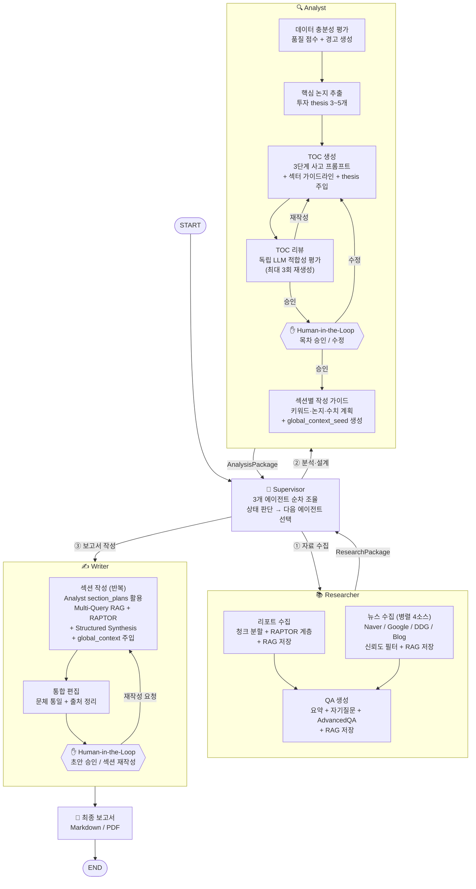

# LangGraph 설계도 — 증권 리포트 자동 보고서 생성 시스템

**작성일:** 2026-04-12  
**수정일:** 2026-04-13  
**버전:** 0.3 (Researcher / Analyst / Writer 3-에이전트 구조)

---

## 1. 아키텍처 개요

**외부:** Supervisor가 3개 에이전트(Researcher / Analyst / Writer)를 순차 조율  
**내부:** 각 에이전트는 독립 서브그래프로 세부 작업을 병렬·순차 처리

```
Supervisor Graph
  ├── Researcher  (서브그래프 — 수집 전담)
  ├── Analyst     (서브그래프 — 분석·설계 전담)
  └── Writer      (서브그래프 — 생성·편집 전담)
```

---

## 2. 전체 그래프 구조



---

## 3. Supervisor 라우팅 로직

```python
def supervisor_router(state: SupervisorState) -> str:
    if not state.get("research_done"):
        return "researcher"      # ① 수집 미완료
    if not state.get("analysis_done"):
        return "analyst"         # ② 분석 미완료
    if not state.get("writing_done"):
        return "writer"          # ③ 작성 미완료
    return "finalize"
```

---

## 4. State 구조

### 4.1 SupervisorState — 조율용 공유 State

```python
from typing import TypedDict

class ResearchPackage(TypedDict):
    report_chunks: list[dict]       # RAPTOR 계층 포함
    news_chunks: list[dict]         # 신뢰도 등급 포함
    summaries: list[str]
    qa_pairs: list[dict]
    advanced_qa_pairs: list[dict]

class AnalysisPackage(TypedDict):
    toc: list[dict]                 # [{"title": ..., "key_message": ...}]
    thesis_list: list[dict]         # 핵심 투자 논지 (extract_thesis 결과)
    section_plans: list[dict]       # 섹션별 작성 가이드 (plan_sections 결과)
    global_context_seed: str        # Writer 초기 global_context

class SupervisorState(TypedDict):
    # 입력
    topic: str
    company_name: str
    ticker: str
    sector: str

    # 에이전트 패키지 (결과물 단위)
    research: ResearchPackage
    analysis: AnalysisPackage

    # 진행 상태
    research_done: bool
    analysis_done: bool
    writing_done: bool

    # 출력
    final_report: str
```

### 4.2 에이전트별 Private State (내부 전용)

| State | 주요 필드 | 접근 주체 |
|-------|---------|----------|
| `ResearcherState` | file_paths, raw_texts, naver_raw, qa_draft... | Researcher 전용 |
| `AnalystState` | rag_context, thinking_steps, toc_draft, review_feedback... | Analyst 전용 |
| `WriterState` | current_section_idx, global_context, rag_results, section_draft... | Writer 전용 |

> 에이전트 내부 State 상세는 `state_design.md` 참고

---

## 5. Researcher 내부 서브그래프

```python
from langgraph.types import Send

def dispatch_researcher(state: ResearcherState):
    """리포트 수집과 뉴스 수집을 병렬 실행"""
    return [
        Send("collect_reports", {...}),
        Send("fetch_news",      {...}),   # 4개 소스 내부에서 다시 병렬
    ]
    # QA 생성은 리포트 수집 완료 후 순차 실행

# 내부 노드 순서
# collect_reports || fetch_news → generate_qa → advanced_qa → [완료]
```

---

## 6. Analyst 내부 서브그래프

```python
# TOC 재생성 횟수 제한
MAX_TOC_ITERATIONS = 3

def route_after_review(state: AnalystState) -> str:
    if state["review_approved"]:
        return "human_toc_approval"
    if state["toc_iteration"] >= MAX_TOC_ITERATIONS:
        return "human_toc_approval"   # 강제로 Human에게 넘김
    return "build_toc"               # 재생성

# Checkpointer 설정 (Human-in-the-Loop 필수)
analyst_graph = analyst_flow.compile(
    checkpointer=checkpointer,
    interrupt_before=["human_toc_approval"]
)
```

---

## 7. Writer 내부 서브그래프

```python
def route_after_section(state: WriterState) -> str:
    if state["current_section_idx"] < len(state["toc"]):
        return "write_section"    # 다음 섹션 작성
    return "edit_draft"           # 전체 편집

def route_after_human(state: WriterState) -> str:
    if state["human_edits"]:
        return "write_section"    # 수정 요청된 섹션 재작성
    return "finalize"

# Checkpointer 설정
writer_graph = writer_flow.compile(
    checkpointer=checkpointer,
    interrupt_before=["human_draft_approval"]
)
```

---

## 8. 에이전트 간 State 매핑

```python
# Supervisor → Researcher 호출
def call_researcher(state: SupervisorState) -> dict:
    result = researcher_graph.invoke(ResearcherState(
        topic=state["topic"],
        ticker=state["ticker"],
        sector=state["sector"],
        # 내부 필드 초기화
        ...
    ))
    return {
        "research": ResearchPackage(
            report_chunks=result["report_chunks"],
            news_chunks=result["news_chunks"],
            summaries=result["summaries"],
            qa_pairs=result["qa_pairs"],
            advanced_qa_pairs=result["advanced_qa_pairs"],
        ),
        "research_done": True
    }

# Supervisor → Analyst 호출
def call_analyst(state: SupervisorState) -> dict:
    result = analyst_graph.invoke(AnalystState(
        topic=state["topic"],
        sector=state["sector"],
        today=today,
        **state["research"],   # ResearchPackage 언팩
        ...
    ))
    return {
        "analysis": AnalysisPackage(
            toc=result["toc"],
            global_context_seed=result["global_context_seed"],
        ),
        "analysis_done": True
    }

# Supervisor → Writer 호출
def call_writer(state: SupervisorState) -> dict:
    result = writer_graph.invoke(WriterState(
        toc=state["analysis"]["toc"],
        global_context=state["analysis"]["global_context_seed"],
        **state["research"],   # ResearchPackage 언팩
        ...
    ))
    return {
        "final_report": result["final_report"],
        "writing_done": True
    }
```

---

## 9. Checkpointer & Store 적용 위치

```
[Checkpointer]
Supervisor Graph     ← 전체 상태 스냅샷
Analyst 서브그래프   ← interrupt_before: human_toc_approval
Writer 서브그래프    ← interrupt_before: human_draft_approval
                       + 섹션별 체크포인트 (에러 복구)

[Store]
Researcher  → news_cache      (TTL 1시간)
Researcher  → qa_cache        (TTL 7일)
Researcher  → advanced_qa_cache (유형별 TTL)
Analyst     → toc_history     (영구, 편집 패턴 학습)
Supervisor  → report_archive  (영구, 보고서 아카이브)
```

---

## 10. RAG 검색 전략

```
검색 스코어 = 벡터 유사도 × 날짜 가중치 × 소스 신뢰도

날짜 가중치:  w(d) = exp(-λ × 경과일수)
소스 신뢰도:  증권사 리포트=1.0 / 뉴스=0.8 / 블로그=0.5

RAPTOR 레벨 선택:
  Analyst TOC 생성  → Level 2 (전체요약)
  Writer 섹션 작성  → Level 1 (중간요약) + Level 0 (수치 청크)
  Researcher QA    → Level 0 (원문 청크)
```

---

## 11. 구현 순서

1. Researcher 서브그래프 구현 및 RAG 저장 확인
2. RAPTOR 인덱싱 파이프라인 구축
3. Analyst 서브그래프 구현 (TOC → 리뷰 → Human 승인)
4. Writer 서브그래프 구현 (Multi-Query + Structured Synthesis)
5. Supervisor 연결 및 패키지 매핑 구현
6. Store 캐시 및 히스토리 적용
7. Human-in-the-Loop UI 연결
