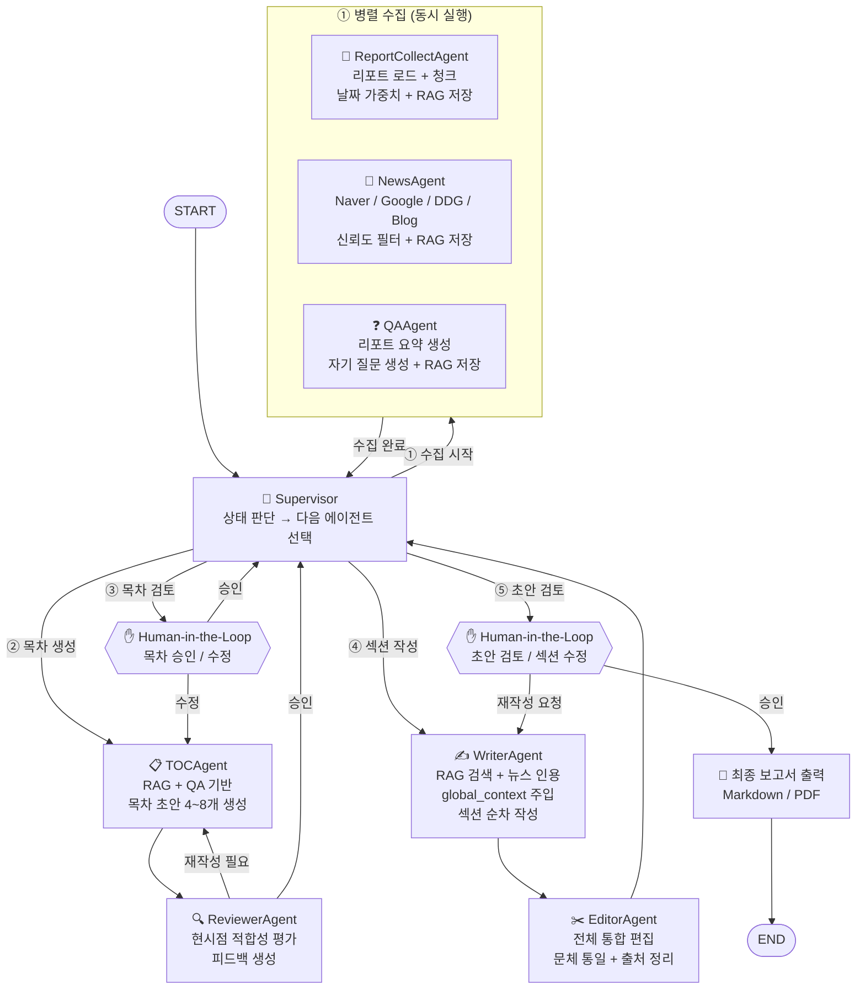

# LangGraph 설계도 — 증권 리포트 자동 보고서 생성 시스템

**작성일:** 2026-04-12  
**수정일:** 2026-04-13  
**버전:** 0.2 (멀티에이전트 구조 반영)

---

## 1. 아키텍처 개요

단일 그래프 방식 → **Supervisor + Subagent 멀티에이전트** 방식으로 전환.  
각 에이전트는 독립 그래프로 구성되며, Supervisor가 전체 상태를 보고 다음 에이전트를 결정한다.

```
Supervisor Graph
    ├── ReportCollectAgent  (서브그래프)
    ├── NewsAgent           (서브그래프)
    ├── QAAgent             (서브그래프)
    ├── TOCAgent            (서브그래프)
    ├── ReviewerAgent       (서브그래프)
    ├── WriterAgent         (서브그래프)
    └── EditorAgent         (서브그래프)
```

---

## 2. 전체 그래프 구조 (Supervisor 패턴)



---

## 3. Supervisor 라우팅 로직

```python
def supervisor_router(state: ReportState) -> str:
    if not state.get("report_chunks"):
        return "collect_group"       # ① 수집 미완료 → 병렬 수집
    if not state.get("toc_draft"):
        return "toc_agent"           # ② 목차 초안 미생성
    if not state.get("toc_approved"):
        return "human_toc"           # ③ 목차 Human 검토 대기
    if not state.get("sections_done"):
        return "writer_agent"        # ④ 본문 작성 미완료
    if not state.get("draft_approved"):
        return "human_draft"         # ⑤ 초안 Human 검토 대기
    return "finalize"
```

---

## 4. 공유 State 정의

```python
from typing import TypedDict

class ReportState(TypedDict):
    # 입력
    topic: str                        # 보고서 주제 (종목명, 테마 등)

    # ① 수집 결과
    report_chunks: list[dict]         # 청크 + 날짜 가중치 메타
    news_chunks: list[dict]           # 뉴스 + 소스 신뢰도 메타
    summaries: list[str]              # 리포트 요약
    qa_pairs: list[dict]              # {"question": ..., "answer": ..., "source": ...}

    # ② 목차
    toc_draft: list[str]              # TOCAgent 초안
    review_feedback: str              # ReviewerAgent 피드백
    toc_approved: bool                # Human 승인 여부
    toc: list[str]                    # 최종 확정 목차

    # ③ 본문
    global_context: str               # 섹션 간 일관성 유지 누적 컨텍스트
    current_section_idx: int          # 현재 작성 중인 섹션 인덱스
    sections: list[dict]              # [{"title", "keywords", "draft", "sources"}]
    sections_done: bool               # 전체 섹션 완료 여부

    # ④ 검토
    draft_approved: bool              # Human 초안 승인 여부
    human_edits: dict                 # {"section_idx": "수정 내용"}

    # 출력
    final_report: str                 # 최종 보고서 Markdown
```

---

## 5. 서브에이전트별 상세

### 5.1 ReportCollectAgent
```
그래프: report_collect_graph
도구:   file_loader, text_splitter, date_weight_calculator, rag_upsert
입력:   topic
출력:   report_chunks → State 업데이트
```

### 5.2 NewsAgent
```
그래프: news_graph
도구:   naver_news, google_news, ddg_news, naver_blog, dedup_filter, rag_upsert
입력:   topic, keywords
출력:   news_chunks → State 업데이트
병렬:   4개 소스를 Send API로 동시 수집 후 병합
```

### 5.3 QAAgent
```
그래프: qa_graph
도구:   rag_search(summaries), llm_generate(소형 모델), rag_upsert
입력:   summaries
출력:   qa_pairs → State 업데이트
```

### 5.4 TOCAgent
```
그래프: toc_graph
도구:   rag_search(reports + news + qa), llm_generate(Chain-of-Thought)
입력:   report_chunks, news_chunks, qa_pairs
출력:   toc_draft → State 업데이트
전략:   현재 날짜 컨텍스트 주입, deep thinking 프롬프트
```

### 5.5 ReviewerAgent
```
그래프: reviewer_graph (TOCAgent와 독립 LLM 인스턴스)
평가:   현시점 관련성, 데이터 커버리지, 항목 중복/누락, 독자 완결성
입력:   toc_draft
출력:   review_feedback ("승인" or "재작성: <사유> / <개선안>")
```

### 5.6 WriterAgent
```
그래프: writer_graph
도구:   rag_search(날짜 가중치 적용), news_search, llm_generate
입력:   toc[current_section_idx], global_context
출력:   sections[idx].draft → global_context 업데이트 → 반복
```

### 5.7 EditorAgent
```
그래프: editor_graph
도구:   llm_generate
입력:   sections (전체)
출력:   merged_draft (문체 통일 + 출처 정리)
```

---

## 6. 병렬 수집 — Send API 활용

```python
from langgraph.types import Send

def dispatch_collection(state: ReportState):
    """ReportCollect / News / QA 세 에이전트를 동시에 실행"""
    return [
        Send("report_collect_agent", {"topic": state["topic"]}),
        Send("news_agent",           {"topic": state["topic"]}),
        Send("qa_agent",             {"topic": state["topic"]}),
    ]
```

NewsAgent 내부에서도 4개 소스를 Send로 병렬 수집:

```python
def dispatch_news_sources(state):
    sources = ["naver_news", "google_news", "ddg_news", "naver_blog"]
    return [Send(src, {"topic": state["topic"]}) for src in sources]
```

---

## 7. RAG 검색 전략

```
검색 스코어 = 벡터 유사도 × 날짜 가중치 × 소스 신뢰도

날짜 가중치:  w(d) = exp(-λ × 경과일수)
소스 신뢰도:  증권사 리포트=1.0 / 뉴스=0.8 / 블로그=0.5
```

---

## 8. Human-in-the-Loop 인터페이스

| 단계 | 개입 지점 | 사용자 액션 |
|------|----------|------------|
| 목차 검토 | ReviewerAgent 승인 후 | 항목 추가·삭제·순서 변경 후 승인 |
| 초안 검토 | EditorAgent 완료 후 | 섹션 지정 재작성 요청 또는 전체 승인 |

| UI 옵션 | 장점 | 단점 |
|---------|------|------|
| CLI interrupt | 구현 간단, LangGraph 기본 지원 | UX 불편 |
| Streamlit | 시각적 편집 용이 | 별도 서버 필요 |
| Telegram 봇 | 모바일 승인 가능 | 텍스트 편집 제한 |

> **권장:** CLI interrupt → Streamlit 또는 Telegram 순차 전환

---

## 9. 구현 순서

1. `ReportCollectAgent` + `NewsAgent` 단독 구현 및 RAG 저장 확인
2. `QAAgent` 구현 및 qa_pairs 저장 확인
3. `TOCAgent` + `ReviewerAgent` 연결 (피드백 루프 검증)
4. `WriterAgent` — global_context 누적 동작 검증
5. `EditorAgent` 구현 및 통합 편집 품질 확인
6. `Supervisor` 추가하여 전체 통합
7. 병렬 수집 (Send API) 적용
8. Human-in-the-Loop 인터페이스 연결
