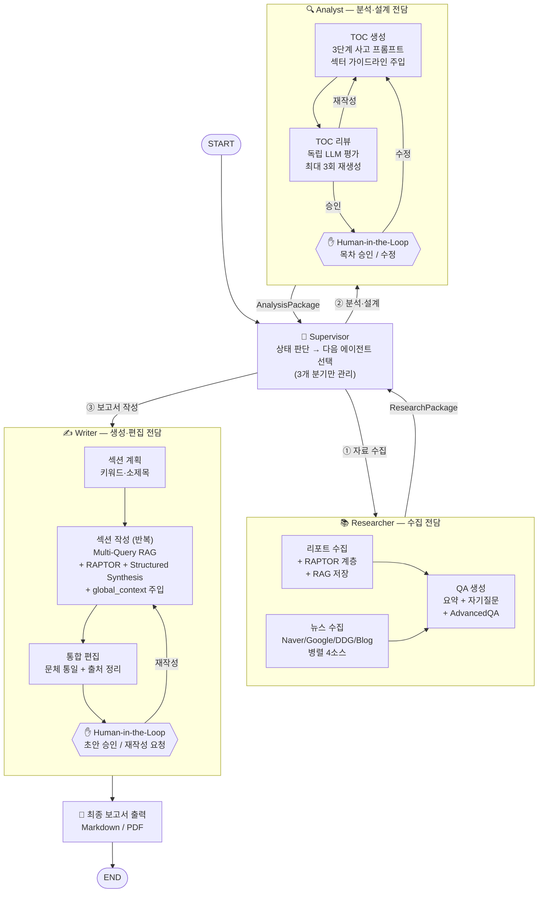

# 멀티에이전트 설계도 — 증권 리포트 자동 보고서 생성 시스템

**작성일:** 2026-04-12  
**수정일:** 2026-04-13  
**버전:** 0.2 (Researcher / Analyst / Writer 3-에이전트 구조)  
**패턴:** Supervisor + 3 Subagent (LangGraph Multi-Agent)

---

## 1. 왜 멀티에이전트인가

| 단일 그래프 방식 | 멀티에이전트 방식 |
|-----------------|-----------------|
| 노드가 많아질수록 그래프 복잡도 급증 | 에이전트별 독립 서브그래프로 관심사 분리 |
| 특정 단계 실패 시 전체 재실행 | 에이전트 단위 재시도 및 에러 복구 |
| 병렬 처리 구현이 복잡 | Researcher 내부에서 자연스럽게 병렬 처리 |
| 역할 경계 모호 | 실제 팀 구조(Researcher/Analyst/Writer)와 일치 |

---

## 2. 에이전트 구성

```
┌─────────────────────────────────────────────┐
│              SUPERVISOR                     │
│         (전체 워크플로 3단계 조율)             │
└──────────┬──────────┬──────────┬────────────┘
           │ ①        │ ②        │ ③
           ▼          ▼          ▼
    ┌──────────┐ ┌──────────┐ ┌──────────┐
    │Researcher│ │ Analyst  │ │  Writer  │
    │          │ │          │ │          │
    │리포트 수집 │ │목차 생성  │ │보고서 작성│
    │뉴스 수집  │ │목차 리뷰  │ │통합 편집  │
    │QA 생성   │ │Human 승인 │ │Human 승인 │
    │AdvancedQA│ │          │ │          │
    └──────────┘ └──────────┘ └──────────┘
```

---

## 3. Supervisor 패턴 Mermaid 다이어그램



---

## 4. 에이전트별 상세 정의

### 4.1 Supervisor

```python
def supervisor_router(state: SupervisorState) -> str:
    if not state.get("research_done"):  return "researcher"
    if not state.get("analysis_done"): return "analyst"
    if not state.get("writing_done"):  return "writer"
    return "finalize"
```

### 4.2 Researcher

```
내부 서브그래프 노드:
  collect_reports  — /user/boon/report 로드, 청크 분할, RAPTOR 계층 생성, RAG 저장
  fetch_news       — Naver/Google/DDG/Blog 병렬 수집, 신뢰도 필터, RAG 저장
  generate_qa      — 리포트 요약, 자기 질문 생성, qa_pairs RAG 저장
  advanced_qa      — 갭 분석, 인터넷 검색 QA, advanced_qa RAG 저장

병렬 실행:
  collect_reports || fetch_news  (Send API)
  → generate_qa → advanced_qa   (순차, report_chunks 의존)

출력: ResearchPackage
  {report_chunks, news_chunks, summaries, qa_pairs, advanced_qa_pairs}

도구:
  file_loader, text_splitter, raptor_indexer, rag_upsert
  naver_news, google_news, ddg_news, naver_blog, dedup_filter
  llm_generate (소형 모델), internet_search
```

### 4.3 Analyst

```
내부 서브그래프 노드:
  build_toc     — 5개 컬렉션 병렬 RAG 검색, 3단계 CoT 프롬프트, 목차 초안 생성
  review_toc    — 독립 LLM으로 현시점 적합성 평가, 피드백 생성 (최대 3회)
  human_toc     — Human-in-the-Loop (interrupt)

Checkpointer:
  interrupt_before=["human_toc"]

출력: AnalysisPackage
  {toc: [{"title": ..., "key_message": ...}], global_context_seed}

도구:
  rag_search (5개 컬렉션 병렬), llm_generate (Sonnet급)
  store.get (toc_history — 이전 편집 패턴 참고)
  store.put (toc_history — 편집 결과 저장)
```

### 4.4 Writer

```
내부 서브그래프 노드:
  plan_sections   — 섹션별 키워드·소제목 생성
  write_section   — Multi-Query RAG + RAPTOR + Structured Synthesis, global_context 주입, 반복
  edit_draft      — 전체 통합 편집, 문체 통일, 출처 정리
  human_draft     — Human-in-the-Loop (interrupt)

Checkpointer:
  interrupt_before=["human_draft"]
  + 섹션별 체크포인트 (에러 복구용)

출력: final_report (Markdown)

도구:
  rag_search (Multi-Query, RAPTOR 레벨 지정)
  llm_generate (Sonnet급, Structured Output)
  store.get (report_archive — 이전 보고서 섹션 참고)
  store.put (report_archive — 최종 보고서 저장)
```

---

## 5. 에이전트 간 인터페이스 (패키지 단위)

```python
class ResearchPackage(TypedDict):
    report_chunks: list[dict]       # RAPTOR 계층 메타 포함
    news_chunks: list[dict]         # 소스 신뢰도 메타 포함
    summaries: list[str]
    qa_pairs: list[dict]
    advanced_qa_pairs: list[dict]

class AnalysisPackage(TypedDict):
    toc: list[dict]                 # [{"title": ..., "key_message": ...}]
    global_context_seed: str        # Writer 초기 컨텍스트

# Supervisor State: 패키지 단위로 관리
class SupervisorState(TypedDict):
    topic: str
    ticker: str
    sector: str
    company_name: str
    research: ResearchPackage
    analysis: AnalysisPackage
    research_done: bool
    analysis_done: bool
    writing_done: bool
    final_report: str
```

---

## 6. 내부 상세 설계 문서 연결

각 에이전트 내부의 세부 구현은 다음 문서를 참고한다.

| 에이전트 | 내부 구성 요소 | 참고 문서 |
|---------|-------------|---------|
| Researcher | 뉴스 수집 로직 | `news_agent.md` |
| Researcher | QA 생성 로직 | `qa_agent.md` |
| Researcher | AdvancedQA 로직 | `advanced_qa_agent.md` |
| Analyst | TOC 생성 로직 | `toc_agent.md` |
| Writer | Advanced RAG 전략 | `advanced_rag_design.md` |
| 전체 | State 계층 구조 | `state_design.md` |
| 전체 | Memory & Store | `memory_store_design.md` |

---

## 7. 구현 순서

1. Researcher 서브그래프 구현 및 RAG 저장 확인
2. RAPTOR 인덱싱 파이프라인 구축
3. Analyst 서브그래프 구현 (TOC → 리뷰 → Human 승인)
4. Writer 서브그래프 구현 (Multi-Query + Structured Synthesis)
5. Supervisor 연결 및 패키지 매핑 구현
6. Store 캐시·히스토리 적용
7. Human-in-the-Loop UI 연결
