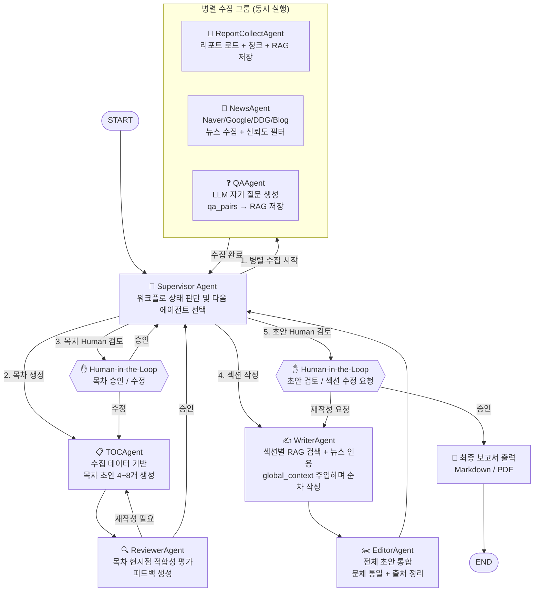

# 멀티에이전트 설계도 — 증권 리포트 자동 보고서 생성 시스템

**작성일:** 2026-04-12  
**버전:** 0.1  
**패턴:** Supervisor + Subagent (LangGraph Multi-Agent)

---

## 1. 왜 멀티에이전트인가

| 단일 그래프 방식 | 멀티에이전트 방식 |
|-----------------|-----------------|
| 노드가 많아질수록 그래프 복잡도 급증 | 에이전트별 독립 그래프로 관심사 분리 |
| 특정 단계 실패 시 전체 재실행 | 에이전트 단위 재시도 가능 |
| 병렬 처리 구현이 어색함 | 자료수집 에이전트들을 자연스럽게 병렬 실행 |
| 역할 경계 모호 | 에이전트마다 명확한 책임 (Single Responsibility) |

---

## 2. 에이전트 구성

```
┌─────────────────────────────────────────────┐
│           SUPERVISOR AGENT                  │
│       (전체 워크플로 조율 및 라우팅)             │
└──────────────────┬──────────────────────────┘
                   │ 태스크 위임 / 결과 수집
     ┌─────────────┼─────────────┐
     │             │             │
     ▼             ▼             ▼
┌─────────┐  ┌──────────┐  ┌──────────┐
│ Report  │  │  News    │  │  QA      │
│ Collect │  │  Agent   │  │  Agent   │
│ Agent   │  │          │  │          │
└─────────┘  └──────────┘  └──────────┘
  리포트 수집    뉴스 수집       자기 질문 생성
  청크 분할     다중 소스        QA → RAG 저장
  RAG 저장     신뢰도 필터

                   │ 수집 완료 신호
                   ▼
┌─────────────────────────────────────────────┐
│              TOC AGENT                      │
│      목차 초안 생성 (4~8개 항목)               │
└──────────────────┬──────────────────────────┘
                   │
                   ▼
┌─────────────────────────────────────────────┐
│             REVIEWER AGENT                  │
│     목차 적합성 평가 및 개선 피드백 제공          │
└──────────────────┬──────────────────────────┘
                   │
                   ▼
           ✋ Human-in-the-Loop
              목차 승인 / 수정
                   │
                   ▼
┌─────────────────────────────────────────────┐
│              WRITER AGENT                   │
│   섹션별 초안 작성 (global_context 유지)        │
│   → 각 섹션을 순차 또는 병렬로 처리             │
└──────────────────┬──────────────────────────┘
                   │
                   ▼
┌─────────────────────────────────────────────┐
│              EDITOR AGENT                   │
│   전체 초안 통합 · 출처 정리 · 문체 통일         │
└──────────────────┬──────────────────────────┘
                   │
                   ▼
           ✋ Human-in-the-Loop
              초안 검토 / 섹션 수정 요청
                   │
                   ▼
             최종 보고서 출력
```

---

## 3. Supervisor 패턴 Mermaid 다이어그램



---

## 4. 각 에이전트 상세 정의

### 4.1 Supervisor Agent
```python
# 역할: 전체 상태를 보고 다음 실행할 에이전트를 결정
# LangGraph에서 conditional_edge로 구현

def supervisor_router(state: ReportState) -> str:
    if not state["report_chunks"]:
        return "collect_group"       # 수집 미완료
    if not state["toc"]:
        return "toc_agent"           # 목차 미생성
    if not state["toc_approved"]:
        return "human_toc"           # 목차 미승인
    if not state["sections_done"]:
        return "writer_agent"        # 본문 미작성
    if not state["draft_approved"]:
        return "human_draft"         # 초안 미승인
    return "finalize"
```

### 4.2 ReportCollect Agent
```
도구(Tools):
  - file_loader: /user/boon/report/ 파일 읽기
  - text_splitter: 섹션 단위 청크 분할
  - rag_upsert: report_db/reports 컬렉션 저장

입력: topic (종목/테마)
출력: report_chunks (청크 리스트 + 날짜 가중치 메타)
```

### 4.3 News Agent
```
도구(Tools):
  - naver_news_search: Naver 뉴스 API
  - google_news_search: Google News 스크래핑
  - ddg_news_search: DuckDuckGo 뉴스
  - naver_blog_search: Naver 블로그
  - dedup_filter: 중복 뉴스 제거
  - rag_upsert: report_db/news 컬렉션 저장

입력: topic, keywords
출력: news_chunks (신뢰도 등급 포함)
```

### 4.4 QA Agent
```
도구(Tools):
  - rag_search: 리포트 요약 검색
  - llm_generate: 질문 생성 (소형 모델 가능)
  - rag_upsert: report_db/qa_pairs 저장

입력: summaries
출력: qa_pairs [{"question": ..., "answer": ..., "source": ...}]
```

### 4.5 TOC Agent
```
도구(Tools):
  - rag_search: summaries + qa_pairs + news 검색
  - llm_generate: 목차 생성 (deep thinking 모드)

입력: report_chunks, news_chunks, qa_pairs
출력: toc_draft [str × 4~8]
프롬프트 전략: Chain-of-Thought + 현재 날짜 컨텍스트 주입
```

### 4.6 Reviewer Agent
```
역할: TOC Agent와 독립된 LLM 인스턴스로 목차 품질 평가
평가 기준:
  - 현시점(날짜) 관련성
  - 수집된 데이터로 작성 가능한지
  - 항목 간 중복/누락 여부
  - 독자 관점 완결성

출력: review_feedback (승인 or 재작성 사유 + 개선안)
```

### 4.7 Writer Agent
```
도구(Tools):
  - rag_search: 섹션 키워드 기반 RAG 검색 (날짜 가중치 적용)
  - news_search: 섹션 관련 최신 뉴스 재검색
  - llm_generate: 섹션 초안 작성

입력: toc[current_idx], global_context
출력: sections[current_idx].draft (출처 인용 포함)
반복: 모든 섹션 완료까지 순차 실행
      → 각 섹션 완료 후 global_context 업데이트
```

### 4.8 Editor Agent
```
역할: WriterAgent 결과물 전체 통합 편집
작업:
  - 섹션 간 문체 통일
  - 중복 내용 제거
  - 출처 인용 형식 정리
  - 서론/결론 연결 자연스럽게 보완

입력: sections (전체)
출력: merged_draft (완성된 보고서 초안)
```

---

## 5. 병렬 실행 설계 (Send API 활용)

LangGraph의 `Send` API를 사용해 섹션 작성을 병렬화할 수도 있습니다.

```python
from langgraph.types import Send

def dispatch_sections(state: ReportState):
    """각 섹션을 독립 WriterAgent로 병렬 전송"""
    return [
        Send("writer_agent", {"section_title": title, "global_context": state["global_context"]})
        for title in state["toc"]
    ]

# 단, global_context 일관성이 필요하면 순차 실행 권장
# 병렬: 속도 우선 / 순차: 문맥 일관성 우선
```

---

## 6. 단일 그래프 vs 멀티에이전트 비교

| 항목 | 단일 그래프 | 멀티에이전트 |
|------|-----------|------------|
| 구현 복잡도 | 낮음 | 중간 |
| 디버깅 | 노드 단위 | 에이전트 단위 (더 명확) |
| 병렬 수집 | 수동 구현 필요 | 자연스럽게 분리 |
| 에이전트 재사용 | 불가 | 가능 (NewsAgent를 다른 프로젝트에도 활용) |
| 토큰 컨텍스트 관리 | 단일 State 공유 | 에이전트별 독립 컨텍스트 |
| Human-in-the-Loop | 동일하게 지원 | 동일하게 지원 |

---

## 7. 권장 구현 순서

1. `ReportCollectAgent` + `NewsAgent` 단독 구현 및 테스트
2. `QAAgent` 구현 및 RAG 저장 확인
3. `TOCAgent` + `ReviewerAgent` 연결 (Supervisor 없이 직접 연결)
4. `WriterAgent` + `EditorAgent` 구현
5. `Supervisor` 추가하여 전체 통합
6. Human-in-the-Loop 인터페이스 연결 (CLI → 이후 UI)
