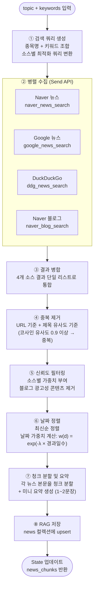

# NewsAgent 상세 설계

**작성일:** 2026-04-13

---

## 1. 역할 요약

NewsAgent는 주어진 종목/테마에 대한 최신 뉴스를 **4개 소스에서 병렬로 수집**하고,  
중복 제거·신뢰도 필터링을 거쳐 RAG `news` 컬렉션에 저장한다.  
출처 인용을 포함한 미니 Perplexity 방식으로 결과를 제공한다.

---

## 2. 지원 소스 및 우선순위

| 순위 | 소스 | 신뢰도 | 특징 |
|------|------|--------|------|
| 1 | Naver 뉴스 API | 0.85 | 한국 주요 언론사 커버, 공식 API 제공 |
| 2 | Google News | 0.80 | 글로벌 + 국내 뉴스, 다양한 언론사 |
| 3 | DuckDuckGo 뉴스 | 0.75 | API 불필요, 빠른 수집 |
| 4 | Naver 블로그 | 0.50 | 현장 정보·개인 분석, 광고성 필터 필수 |

---

## 3. 처리 흐름



---

## 4. 소스별 수집 상세

### 4.1 Naver 뉴스 API

```python
# 공식 API 사용 (CLIENT_ID / CLIENT_SECRET 필요)
GET https://openapi.naver.com/v1/search/news.json
  ?query={검색어}
  &display=20          # 최대 100
  &start=1
  &sort=date           # 최신순
```

**수집 필드:** title, originallink, link, description, pubDate  
**특이사항:** 중복 URL이 많으므로 `originallink` 기준 dedup 필수

---

### 4.2 Google News (RSS 방식)

```python
# Google News RSS (API 키 불필요)
GET https://news.google.com/rss/search
  ?q={검색어}
  &hl=ko
  &gl=KR
  &ceid=KR:ko
```

**수집 필드:** title, link, pubDate, source  
**특이사항:** Google 리다이렉트 URL을 원본 URL로 변환 필요

---

### 4.3 DuckDuckGo 뉴스

```python
# duckduckgo-search 라이브러리 활용
from duckduckgo_search import DDGS

with DDGS() as ddgs:
    results = ddgs.news(
        keywords=query,
        region="kr-ko",
        safesearch="off",
        timelimit="m",    # 최근 1개월
        max_results=20
    )
```

**수집 필드:** title, url, body, date, source  
**특이사항:** rate limit 주의, 요청 간 0.5초 딜레이 권장

---

### 4.4 Naver 블로그

```python
# 공식 API 사용
GET https://openapi.naver.com/v1/search/blog.json
  ?query={검색어}
  &display=10          # 블로그는 10개로 제한 (품질 우선)
  &sort=date
```

**수집 필드:** title, link, description, postdate  
**필터링 규칙:**
- 제목에 광고성 키워드 포함 시 제거: `["협찬", "광고", "리뷰 이벤트", "무료체험"]`
- 본문 길이 300자 미만 → 제거 (내용 부실)
- 포스팅일이 90일 이상 지난 경우 → 낮은 가중치 적용

---

## 5. 검색 쿼리 생성 전략

단순히 종목명만 검색하면 관련 없는 뉴스가 많이 나온다.  
**쿼리를 동적으로 조합**하여 관련성을 높인다.

```python
def build_search_queries(topic: str, keywords: list[str], source: str) -> list[str]:
    """
    소스별 최적화된 검색 쿼리 목록 생성
    """
    base_queries = [
        topic,                              # "삼성전자"
        f"{topic} 주가",                    # "삼성전자 주가"
        f"{topic} 실적",                    # "삼성전자 실적"
        f"{topic} {keywords[0]}",           # "삼성전자 반도체"
    ]

    if source == "naver_news":
        # Naver는 AND 조건 지원
        return [f"{topic} AND {kw}" for kw in keywords[:3]]

    if source == "google_news":
        # Google은 site 제한 가능
        return [f"{topic} {kw} site:kr" for kw in keywords[:2]] + base_queries[:2]

    if source == "ddg":
        return base_queries[:3]

    if source == "naver_blog":
        # 블로그는 분석·후기 키워드 추가
        return [f"{topic} 분석", f"{topic} 전망 {keywords[0]}"]

    return base_queries
```

---

## 6. 중복 제거 전략

두 단계로 중복을 제거한다.

### 6.1 URL 기반 (빠른 1차 필터)
```python
seen_urls = set()
for item in results:
    url = normalize_url(item["url"])   # 파라미터 제거, 소문자화
    if url not in seen_urls:
        seen_urls.add(url)
        deduped.append(item)
```

### 6.2 제목 유사도 기반 (2차 필터)
```python
from sklearn.metrics.pairwise import cosine_similarity

# 제목을 TF-IDF 벡터화 후 유사도 0.9 이상이면 중복으로 판단
# 같은 사건을 다른 언론사가 거의 동일하게 보도한 경우 제거
# → 신뢰도가 높은 소스(Naver > Google > DDG > Blog) 우선 보존
```

---

## 7. 블로그 광고 필터

```python
SPAM_KEYWORDS = [
    "협찬", "광고", "유료광고", "제품 제공", "리뷰 이벤트",
    "무료체험", "체험단", "원고료", "소정의"
]

def is_spam_blog(title: str, content: str) -> bool:
    text = title + content
    return any(kw in text for kw in SPAM_KEYWORDS)
```

---

## 8. RAG 저장 스키마 (`news` 컬렉션)

```json
{
  "id": "news_삼성전자_20260413_naver_001",
  "text": "삼성전자, 1Q26 반도체 영업이익 6조 돌파 전망...",
  "metadata": {
    "type": "news",
    "source": "naver_news",
    "source_name": "한국경제",
    "url": "https://...",
    "title": "삼성전자, 1Q26 반도체 영업이익 6조 돌파 전망",
    "summary": "증권가는 삼성전자의 1분기 반도체 부문 영업이익이...",
    "published_date": "2026-04-12",
    "collected_date": "2026-04-13",
    "ticker": "005930",
    "reliability": 0.85,
    "date_weight": 0.98
  }
}
```

---

## 9. 미니 Perplexity 방식 출력

뉴스 수집 결과를 단순 리스트로 반환하는 게 아니라,  
**출처 인용 포함 요약**을 생성하여 WriterAgent가 바로 활용할 수 있도록 한다.

```
[뉴스 요약 출력 예시]

삼성전자의 최근 주요 동향:

1. 1Q26 반도체 영업이익 6조 원 돌파가 전망되며, HBM3E 공급 확대가 핵심 요인으로 꼽힌다.
   [한국경제, 2026-04-12]

2. 미국 상무부가 추가 반도체 수출 규제 논의 중이며, 삼성전자의 중국 공장 운영에
   영향을 줄 수 있다는 우려가 제기되고 있다.
   [연합뉴스, 2026-04-11]

3. TSMC가 2nm 공정 양산을 앞당기면서 삼성전자 파운드리 수주 경쟁이 심화되고 있다.
   [전자신문, 2026-04-10]
```

---

## 10. 에러 처리

| 상황 | 처리 방법 |
|------|----------|
| Naver API 한도 초과 (일 25,000건) | Google → DDG 순으로 폴백 |
| Google News 차단 | DDG로 대체 |
| 특정 소스 타임아웃 (5초 초과) | 해당 소스 스킵, 나머지 소스로 진행 |
| 수집 결과 0건 | 키워드 단순화 후 1회 재시도 |
| 블로그 본문 파싱 실패 | description 필드만 사용 |

---

## 11. 성능 최적화

| 항목 | 방법 |
|------|------|
| 동일 키워드 중복 요청 방지 | Redis 캐시 (TTL: 1시간) |
| 병렬 수집 속도 | Send API로 4개 소스 동시 실행 |
| 본문 추출 | 뉴스 URL → BeautifulSoup 본문 추출 (청크 품질 향상) |
| 배치 RAG 저장 | 건별 upsert 대신 배치(50건 단위) upsert |

---

## 12. 다른 에이전트와의 연결

```
NewsAgent
    └─► news_chunks (RAG news 컬렉션)
            │
            ├─► TOCAgent       목차 생성 시 최신 뉴스 반영
            ├─► WriterAgent    섹션 작성 시 뉴스 인용
            └─► AdvancedQAAgent 추가 검색 쿼리의 기초 자료
```
