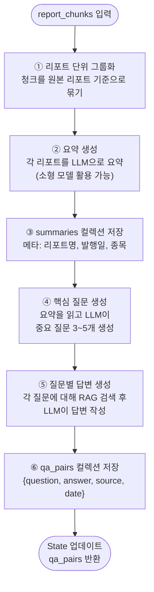

# QAAgent 상세 설계

**작성일:** 2026-04-13

---

## 1. 역할 요약

QAAgent는 수집된 증권사 리포트를 읽고 두 가지 작업을 수행한다:

1. **요약 생성** — 리포트를 압축하여 `summaries` 컬렉션에 저장
2. **자기 질문 생성 (Self-Querying)** — 리포트에서 중요한 질문을 스스로 만들고 답변까지 생성하여 `qa_pairs` 컬렉션에 저장

이 두 결과물은 이후 TOCAgent와 WriterAgent가 RAG 검색 시 재활용한다.

---

## 2. 왜 QAAgent가 필요한가

증권사 리포트는 길고 밀도가 높다. 단순히 청크를 벡터화해서 저장하면 검색 시 "어떤 질문을 해야 하는가"를 사람이 매번 정해야 한다. QAAgent는 이 문제를 해결한다:

| 문제 | QAAgent의 해결 방식 |
|------|-------------------|
| 리포트가 길어 핵심 파악이 어려움 | 요약 생성으로 핵심만 압축 |
| 매번 같은 질문을 다시 생성함 | QA를 RAG에 저장하여 재활용 |
| 리포트에 없는 맥락적 판단이 필요함 | LLM이 스스로 질문을 만들어 답변 |
| 보고서 작성 시 무엇을 다룰지 불명확 | QA가 목차 생성의 힌트 역할 |

---

## 3. 내부 처리 흐름



---

## 4. 질문 생성 전략

### 4.1 질문 유형

QAAgent가 생성하는 질문은 세 가지 유형으로 분류된다:

| 유형 | 예시 | 용도 |
|------|------|------|
| **사실 확인형** | "이 리포트에서 제시한 목표 주가는?" | 수치·사실 빠른 참조 |
| **판단·근거형** | "왜 매수 의견을 제시했는가?" | 논거 추출, 보고서 논지 구성 |
| **리스크형** | "이 종목의 주요 하방 리스크는?" | 보고서 리스크 섹션에 활용 |

### 4.2 질문 생성 프롬프트 구조

```
당신은 금융 애널리스트입니다.
아래 리포트 요약을 읽고, 투자 판단에 중요한 질문을 {n}개 생성하세요.

[요약]
{summary}

조건:
- 사실 확인형, 판단·근거형, 리스크형을 고루 포함
- 수치나 날짜가 있으면 구체적으로 질문할 것
- 중복 질문 금지

출력 형식:
Q1: ...
Q2: ...
```

### 4.3 답변 생성 방식

질문별로 RAG 검색 → 관련 청크 Top-K 가져와 LLM에 주입 → 답변 생성

```
검색 쿼리: question
검색 대상: reports 컬렉션 (날짜 가중치 적용)
Top-K: 3~5개 청크
```

---

## 5. RAG 저장 스키마

### 5.1 summaries 컬렉션

```json
{
  "id": "summary_삼성전자_20260410",
  "text": "삼성전자 1Q26 실적 리뷰. 반도체 부문 영업이익 ...",
  "metadata": {
    "type": "summary",
    "source_file": "samsung_1q26.pdf",
    "ticker": "005930",
    "published_date": "2026-04-10",
    "date_weight": 0.98
  }
}
```

### 5.2 qa_pairs 컬렉션

```json
{
  "id": "qa_삼성전자_20260410_001",
  "text": "Q: 삼성전자의 1Q26 목표 주가는?\nA: KB증권은 95,000원을 제시했으며 ...",
  "metadata": {
    "type": "qa",
    "question": "삼성전자의 1Q26 목표 주가는?",
    "answer": "KB증권은 95,000원을 제시했으며 ...",
    "question_type": "사실확인형",
    "source_file": "samsung_1q26.pdf",
    "ticker": "005930",
    "published_date": "2026-04-10",
    "date_weight": 0.98
  }
}
```

---

## 6. 재활용 전략

같은 종목/테마의 보고서를 다음에 다시 생성할 때, **기존 qa_pairs를 먼저 검색**하여 재사용한다.

```python
# WriterAgent 내 검색 예시
existing_qa = rag_search(
    collection="qa_pairs",
    query=section_title,
    filter={"ticker": state["topic"]},
    top_k=5
)
# 기존 QA가 있으면 재생성 없이 그대로 활용
```

이를 통해 동일 종목 반복 분석 시 LLM 호출 비용을 절감하고 일관된 논지를 유지한다.

---

## 7. 모델 선택 가이드

| 작업 | 권장 모델 | 이유 |
|------|----------|------|
| 리포트 요약 | 소형 모델 (Haiku 등) | 반복 작업, 비용 절감 |
| 질문 생성 | 중형 모델 (Sonnet 등) | 질문 품질이 전체 보고서에 영향 |
| 질문별 답변 | 중형 모델 (Sonnet 등) | RAG 결과 종합 판단 필요 |

---

## 8. 에러 처리

| 상황 | 처리 방법 |
|------|----------|
| 리포트 파일 파싱 실패 | 해당 파일 스킵, 로그 기록 후 계속 진행 |
| 요약 생성 실패 | 원문 청크 앞 500자를 요약 대체로 사용 |
| 질문 생성 결과가 0개 | 기본 질문 템플릿 3개로 폴백 |
| RAG 저장 실패 | 재시도 3회 후 로컬 JSON 파일로 백업 저장 |

---

## 9. 다른 에이전트와의 연결

```
ReportCollectAgent
    └─► report_chunks
            │
            ▼
        QAAgent
            ├─► summaries (RAG 저장)  ◄── TOCAgent가 검색
            └─► qa_pairs  (RAG 저장)  ◄── TOCAgent / WriterAgent가 검색
```

- **TOCAgent**: qa_pairs를 검색하여 목차 항목의 논거와 방향성 결정에 활용
- **WriterAgent**: 섹션 작성 시 관련 QA를 가져와 내용의 근거로 인용
