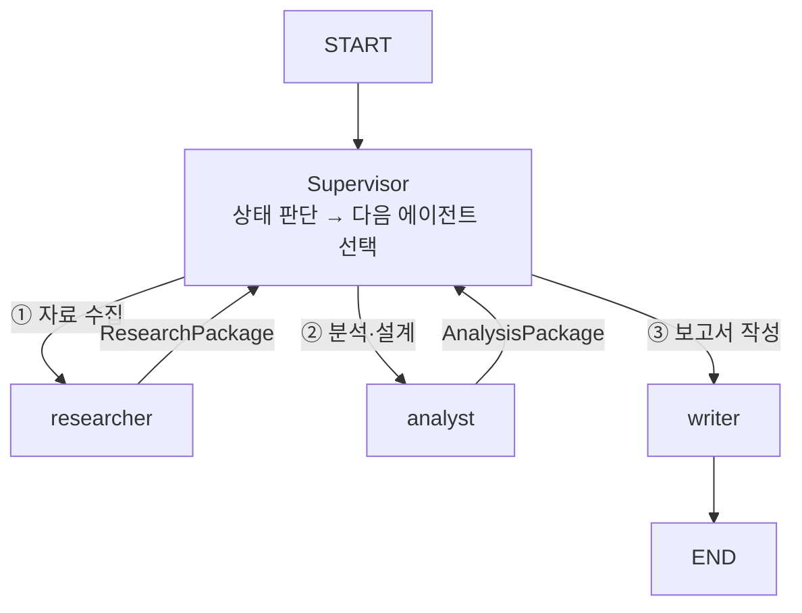

# Supervisor 패턴 — 설계 vs 현재 구현 비교

---

## 1. Supervisor 패턴이란

여러 에이전트를 중앙에서 조율하는 노드.  
각 에이전트가 작업을 마치면 Supervisor에게 결과를 돌려주고,  
Supervisor가 상태를 판단해 다음 에이전트를 선택한다.

```
START → Supervisor ──→ Researcher ──→ Supervisor
                  ──→ Analyst    ──→ Supervisor
                  ──→ Writer     ──→ END
```

LangGraph에서는 **조건부 엣지(Conditional Edge)** 로 구현한다:

```python
def supervisor_router(state: SupervisorState) -> str:
    if not state.get("research_done"):  return "researcher"
    if not state.get("analysis_done"): return "analyst"
    if not state.get("writing_done"):  return "writer"
    return END

builder.add_conditional_edges("supervisor", supervisor_router)
builder.add_edge("researcher", "supervisor")   # 완료 후 항상 supervisor로
builder.add_edge("analyst",    "supervisor")
builder.add_edge("writer",     "supervisor")
```

---

## 2. 초기 설계 — Supervisor 패턴 (multi_agent_design.md)



**SupervisorState 설계**:
```python
class SupervisorState(TypedDict):
    # 진행 상태 플래그
    research_done: bool
    analysis_done: bool
    writing_done:  bool

    # 에이전트 간 전달 패키지
    research_package:  dict   # Researcher → Analyst
    analysis_package:  dict   # Analyst → Writer
```

**장점**:
- 에이전트 실패 시 Supervisor에서 재시도 로직 추가 가능
- 동적 분기 — 상태에 따라 순서 변경, 특정 단계 스킵 가능
- 단일 그래프로 전체 파이프라인 관리

---

## 3. 현재 구현 — Sequential Pipeline (main.py)

Supervisor 노드 없이 `main.py` 가 직접 순서를 제어한다.

```python
# main.py
research_result = researcher_graph.invoke(research_state, ...)
analyst_result  = analyst_graph.invoke(analyst_state, ...)   # research_result 전달
writer_result   = writer_graph.invoke(writer_state, ...)     # analyst_result 전달
```

```
main.py
  │
  ├─ researcher_graph.invoke() → research_result (ChromaDB에 저장)
  │
  ├─ analyst_graph.invoke()   → analyst_result  (MemorySaver에만 존재)
  │       ↑ HITL interrupt 루프 포함
  │
  └─ writer_graph.invoke()    → output_path
```

**각 그래프는 독립적으로 컴파일**:
```python
researcher_graph = build_researcher_graph()   # MemorySaver
analyst_graph    = build_analyst_graph()      # MemorySaver + interrupt_before
writer_graph     = build_writer_graph()       # MemorySaver
```

---

## 4. 두 방식 비교

| 항목 | Supervisor 패턴 | 현재 Sequential |
|------|----------------|----------------|
| 구조 | 단일 그래프, 중앙 조율 노드 | 독립 그래프 3개, main.py 조율 |
| 동적 분기 | 가능 (상태 따라 순서 변경) | 불가 (고정 순서) |
| 에러 복구 | Supervisor에서 재시도 가능 | main.py에서 직접 처리 |
| HITL | Supervisor 안에서 관리 | analyst_graph 안에서 독립 관리 |
| 구현 복잡도 | 높음 (SupervisorState 설계 필요) | 낮음 (각 그래프 독립) |
| 디버깅 | 한 곳에서 전체 추적 | 그래프별 독립 추적 |
| 상태 공유 | SupervisorState 하나로 통합 | 그래프 간 dict로 수동 전달 |

---

## 5. Supervisor로 전환한다면

현재 구조를 Supervisor 패턴으로 바꾸려면 3가지가 필요하다.

### ① 통합 State 정의

```python
class SupervisorState(TypedDict):
    # 공통
    company_name: str
    ticker: str
    sector: str
    today: str

    # 진행 플래그
    research_done: bool
    analysis_done: bool
    writing_done:  bool

    # 에이전트 결과
    report_chunks: list
    news_chunks:   list
    issues:        list
    thesis_list:   list
    toc:           list
    section_plans: list
    output_path:   str
```

### ② Supervisor 라우터

```python
def supervisor_router(state: SupervisorState) -> str:
    if not state.get("research_done"): return "researcher"
    if not state.get("analysis_done"): return "analyst"
    if not state.get("writing_done"):  return "writer"
    return END
```

### ③ 그래프 연결

```python
builder = StateGraph(SupervisorState)
builder.add_node("supervisor", lambda s: s)  # pass-through
builder.add_node("researcher", run_researcher)
builder.add_node("analyst",    run_analyst)
builder.add_node("writer",     run_writer)

builder.add_edge(START,        "supervisor")
builder.add_conditional_edges("supervisor", supervisor_router)
builder.add_edge("researcher", "supervisor")
builder.add_edge("analyst",    "supervisor")
builder.add_edge("writer",     END)
```

---

## 6. 현재 선택의 이유

현재 Sequential 방식을 유지하는 이유:

1. **HITL 관리 단순화**: Analyst 내 interrupt 루프가 이미 복잡하다. Supervisor 안에서 관리하면 중첩 구조가 된다.
2. **그래프별 독립 테스트**: 각 그래프를 단독으로 invoke해서 디버깅하기 쉽다.
3. **충분한 기능**: 3단계 순서가 고정되어 있어 동적 분기가 필요 없다.

Supervisor 패턴은 **에이전트 간 순서가 동적으로 바뀌거나, 특정 조건에서 단계를 반복/스킵해야 할 때** 더 유용하다.
