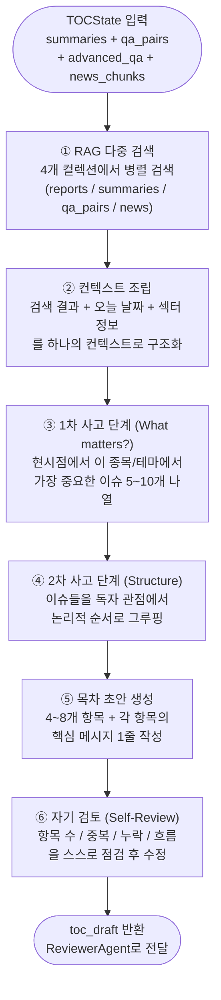

# TOCAgent 상세 설계

**작성일:** 2026-04-13

---

## 1. 역할 요약

TOCAgent는 수집된 모든 데이터(리포트 요약, QA, 뉴스, AdvancedQA)를 종합하여  
보고서의 **목차 초안(4~8개 항목)을 생성**하는 에이전트다.

단순히 항목 나열이 아니라, **현시점 맥락에 맞는 논리적 흐름**을 가진 목차를 만들어야 한다.  
Chain-of-Thought + 현재 날짜 주입 + 깊은 사고(deep thinking) 프롬프트를 사용한다.

---

## 2. 처리 흐름



---

## 3. State 정의

```python
class TOCState(TypedDict):
    # 입력 (SupervisorState에서 매핑)
    topic: str                      # 종목명 또는 테마
    company_name: str
    ticker: str
    sector: str
    today: str                      # 오늘 날짜 (YYYY-MM-DD)
    report_date: str                # 가장 최근 리포트 발행일

    summaries: list[str]
    qa_pairs: list[dict]
    advanced_qa_pairs: list[dict]
    news_chunks: list[dict]

    # 내부 처리용
    rag_context: str                # RAG 검색 결과 종합 텍스트
    thinking_steps: list[str]       # CoT 중간 추론 단계 (디버깅용)
    draft_iteration: int            # 재생성 횟수 (ReviewerAgent 피드백 반영)

    # 출력
    toc_draft: list[dict]           # [{"title": ..., "key_message": ...}]
```

---

## 4. RAG 다중 검색 전략

목차 생성 전 4개 컬렉션에서 동시에 검색하여 풍부한 컨텍스트를 확보한다.

```python
from langgraph.types import Send

def dispatch_rag_search(state: TOCState):
    """4개 컬렉션 병렬 검색"""
    return [
        Send("search_reports",      {"query": state["topic"], "collection": "reports",      "top_k": 5}),
        Send("search_summaries",    {"query": state["topic"], "collection": "summaries",    "top_k": 3}),
        Send("search_qa",           {"query": state["topic"], "collection": "qa_pairs",     "top_k": 5}),
        Send("search_advanced_qa",  {"query": state["topic"], "collection": "advanced_qa",  "top_k": 5}),
        Send("search_news",         {"query": state["topic"], "collection": "news",         "top_k": 7}),
    ]
```

**검색 스코어:** `벡터 유사도 × 날짜 가중치 × 소스 신뢰도`  
→ 최신 뉴스와 최근 리포트가 상위 노출

---

## 5. 동적 프롬프트 설계

TOCAgent의 핵심은 3단계 사고 프롬프트다.  
단계마다 LLM의 출력이 다음 단계 입력으로 들어간다.

### 5.1 1단계 — 현시점 핵심 이슈 추출 프롬프트

```
[시스템]
당신은 투자 리서치 전문가입니다.
오늘 날짜: {today}
리포트 기준일: {report_date}  (오늘로부터 {days_since}일 전)

[분석 대상]
종목: {ticker} / {company_name}
섹터: {sector}

[수집된 정보]
─ 리포트 요약 ─
{summaries_text}

─ 리포트 내 QA ─
{qa_pairs_text}

─ 인터넷 검색 QA ─
{advanced_qa_text}

─ 최신 뉴스 ─
{news_text}

[지시 — 1단계: 이슈 나열]
위 정보를 바탕으로, 오늘 날짜({today}) 기준으로
{company_name}에 대해 투자자가 알아야 할 핵심 이슈를 5~10개 나열하세요.

조건:
- 리포트 발행 이후 새로 생긴 뉴스나 변화가 있으면 반드시 포함
- 각 이슈는 1~2문장으로 구체적으로 작성 (수치 포함 우선)
- 긍정적 이슈와 부정적 이슈(리스크)를 균형 있게 포함

출력 형식:
이슈 1: ...
이슈 2: ...
...
```

### 5.2 2단계 — 목차 구조화 프롬프트

```
[시스템]
오늘 날짜: {today}
분석 대상: {company_name} ({ticker})

[1단계 결과: 핵심 이슈]
{issues_text}

[지시 — 2단계: 목차 구조화]
위 이슈들을 투자 보고서 독자(기관 투자자, 개인 투자자) 관점에서
읽기 좋은 순서로 묶어 목차를 구성하세요.

목차 구성 원칙:
1. 서론 성격의 항목 1개 (현황·배경)
2. 핵심 투자 포인트 2~3개 (긍정 요인)
3. 리스크 요인 1~2개
4. 전망·결론 1개
총 4~8개 항목

조건:
- 각 항목은 독자가 "왜 이걸 읽어야 하는가"를 알 수 있는 제목으로 작성
- 항목 간 논리적 흐름 (원인 → 결과, 현재 → 미래)
- 현 시점({today}) 관련 항목을 앞쪽에 배치

출력 형식 (JSON):
[
  {{"title": "...", "key_message": "이 섹션에서 전달할 핵심 메시지 1줄"}},
  ...
]
```

### 5.3 3단계 — 자기 검토 프롬프트 (Self-Review)

```
[지시 — 3단계: 자기 검토]
아래 목차 초안을 다음 기준으로 검토하고, 문제가 있으면 즉시 수정하세요.

[목차 초안]
{toc_draft_json}

검토 기준:
□ 항목 수가 4~8개인가?
□ 제목 간 중복 또는 지나친 유사성이 없는가?
□ 수집된 데이터로 실제 작성 가능한 항목인가?
□ 오늘 날짜({today}) 기준 시의성이 있는가?
□ 리스크 항목이 최소 1개 포함되어 있는가?
□ 독자가 전체를 읽고 싶어지는 흐름인가?

각 기준을 체크하고, 수정이 필요하면 수정된 목차를 출력하세요.

출력:
체크 결과: [통과 / 수정됨]
수정 이유: (수정된 경우만)
최종 목차 (JSON):
[...]
```

### 5.4 ReviewerAgent 피드백 반영 프롬프트 (재생성 시)

```
[지시 — 목차 재생성]
이전 목차가 리뷰어 에이전트로부터 아래 피드백을 받았습니다.

[이전 목차]
{prev_toc}

[리뷰어 피드백]
{review_feedback}

위 피드백을 반영하여 목차를 수정하세요.
피드백에서 언급한 항목은 반드시 개선하고,
나머지 항목은 가능한 유지하세요.
```

---

## 6. 섹터별 목차 가이드라인 (동적 주입)

섹터에 따라 목차 구성 힌트를 프롬프트에 동적으로 추가한다.

```python
SECTOR_TOC_HINTS = {
    "반도체": [
        "수요/공급 사이클 현황",
        "HBM·AI 반도체 수혜 여부",
        "미국 수출 규제 영향",
        "경쟁사(TSMC, SK하이닉스) 비교",
    ],
    "바이오": [
        "임상 파이프라인 현황",
        "FDA 허가 일정",
        "기술 수출 계약 가능성",
        "자금 조달 현황",
    ],
    "배터리": [
        "전기차 수요 전망",
        "원자재(리튬·코발트) 가격",
        "북미 IRA 보조금 수혜",
        "차세대 배터리 개발 현황",
    ],
    "자동차": [
        "글로벌 판매량 추이",
        "전동화 전환 속도",
        "환율 영향",
        "경쟁사 점유율 변화",
    ],
}

def get_sector_hint(sector: str) -> str:
    hints = SECTOR_TOC_HINTS.get(sector, [])
    if not hints:
        return ""
    return "참고: 이 섹터에서 자주 다뤄지는 주제:\n" + "\n".join(f"- {h}" for h in hints)
```

---

## 7. 출력 스키마

```python
# toc_draft 예시 출력
[
    {
        "title": "1Q26 실적 서프라이즈: 반도체 부문 6조 돌파",
        "key_message": "시장 기대치를 20% 상회하는 영업이익으로 실적 모멘텀 확인"
    },
    {
        "title": "HBM3E 공급 확대로 AI 반도체 수혜 본격화",
        "key_message": "엔비디아 향 HBM 공급 비중 확대가 2026년 하반기 실적을 견인할 전망"
    },
    {
        "title": "파운드리 경쟁 심화: TSMC와의 격차 분석",
        "key_message": "2nm 공정 격차가 좁혀지고 있으나 수율 개선이 관건"
    },
    {
        "title": "미국 대중 수출 규제 리스크 점검",
        "key_message": "중국 매출 비중 15% — 추가 규제 시 연간 영업이익 약 1조 영향 추정"
    },
    {
        "title": "목표 주가 상향 근거와 밸류에이션 분석",
        "key_message": "PBR 1.4배 수준으로 역사적 저점 구간 — 상승 여력 35% 제시"
    }
]
```

---

## 8. 다른 에이전트와의 연결

```
QAAgent          → qa_pairs        ─┐
AdvancedQAAgent  → advanced_qa     ─┤ → TOCAgent → toc_draft → ReviewerAgent
NewsAgent        → news_chunks     ─┤
ReportCollect    → summaries       ─┘

TOCAgent가 생성한 toc_draft는:
  ├── ReviewerAgent  적합성 평가
  └── (승인 후) WriterAgent  각 섹션의 초안 작성 기준
```

---

## 9. 재생성 횟수 제한

ReviewerAgent 피드백으로 인한 무한 재생성을 방지한다.

```python
MAX_TOC_ITERATIONS = 3

def route_after_review(state: TOCState) -> str:
    if state["draft_iteration"] >= MAX_TOC_ITERATIONS:
        # 최대 재생성 횟수 초과 → 강제로 Human에게 넘김
        return "human_toc_approval"

    if state["review_approved"]:
        return "human_toc_approval"
    else:
        return "toc_agent"  # 재생성
```
